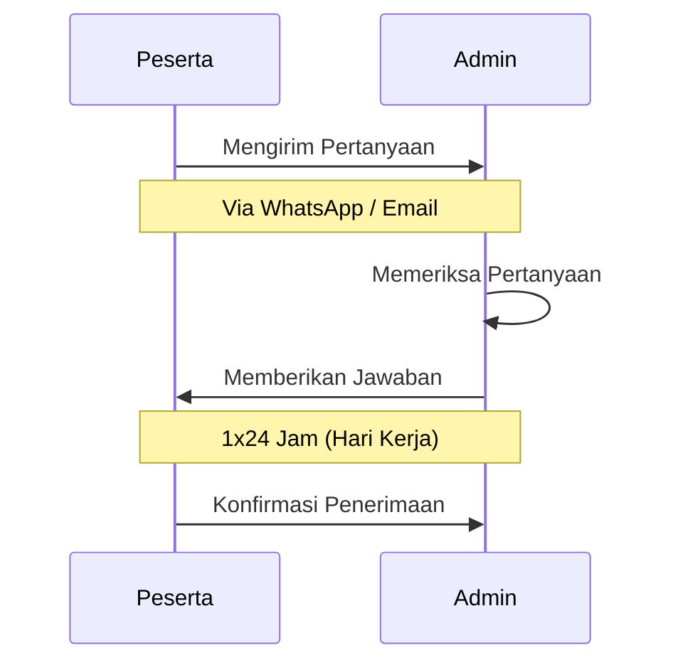

# Hubungi Kami

Jika Anda mengalami kesulitan atau memiliki pertanyaan yang tidak terjawab di FAQ, jangan ragu untuk menghubungi tim administrasi.



## Jam Operasional

| Hari | Jam | Keterangan |
|------|-----|-----------|
| Senin - Kamis | 08.00 - 16.00 WIB | Buka |
| Jumat | 08.00 - 16.30 WIB | Buka |
| Sabtu | 08.00 - 12.00 WIB | Buka (terbatas) |
| Minggu & Libur Nasional | - | Tutup |

::: warning
Pertanyaan yang masuk di luar jam operasional akan dijawab pada jam kerja berikutnya.
:::

## Kontak Admin

<div class="grid-2">

<div class="info-card info">
<div class="info-card-title"> WhatsApp</div>
<div class="info-card-content">
<b>Nomor:</b> <a href="https://wa.me/628116570511">+62 811-6570-511</a><br>
<b>Jam:</b> Sesuai jam operasional<br>
<b>Respon:</b> 1x24 jam<br><br>
Klik link di atas untuk langsung chat WhatsApp.
</div>
</div>

<div class="info-card info">
<div class="info-card-title">📧 Email</div>
<div class="info-card-content">
<b>Alamat:</b> p3m@usu.ac.id<br>
<b>Subjek:</b> [kode event / konseling] - topik masalah<br>
<b>Respon:</b> 1x24 jam<br><br>
Sertakan nomor registrasi dalam email.
</div>
</div>

</div>

## Yang Harus Disiapkan Sebelum Menghubungi Admin

### Jika melalui WhatsApp:

1. **Nomor Registrasi** (jika sudah mendaftar)
2. **Nama Lengkap**
3. **Deskripsi Masalah** yang jelas dan detail
4. **Screenshot** error atau kendala (jika ada)

### Jika melalui Email:

```
Subjek: [kode event / konseling] - topik masalah
Contoh: [PPDGS] - gagal upload dokumen
Contoh: [PPDS] - kendala pembayaran

Isi Email:
- Nama Lengkap:
- Nomor Registrasi:
- Program Studi / Event:
- Deskripsi Masalah:
- Screenshot/Lampiran:
- Kontak yang bisa dihubungi:
```

::: tip
- Jelaskan masalah dengan jelas dan detail
- Sertakan screenshot jika ada error
- Cantumkan nomor registrasi untuk memudahkan pengecekan
- Gunakan bahasa yang sopan
:::

## Hal yang Bisa Ditanyakan ke Admin

| No | Jenis Pertanyaan |
|----|-----------------|
| 1 | Kendala teknis aplikasi |
| 2 | Verifikasi dokumen |
| 3 | Status pembayaran |
| 4 | Perubahan data |
| 5 | Pembatalan pendaftaran |
| 6 | Informasi event |
| 7 | Syarat dan ketentuan |
| 8 | Laporan error sistem |

## Hal yang Sebaiknya Tidak Ditanyakan

::: danger
- Jangan menanyakan informasi yang sudah ada di panduan ini
- Jangan meminta admin mempercepat proses verifikasi (kecuali sudah melebihi batas waktu)
- Jangan mengirim spam atau chat berulang-ulang
- Jangan menanyakan data pribadi peserta lain
:::

## Alamat Kantor

**Fakultas Psikologi Universitas Sumatera Utara**

```
Jl. Dr. Mansyur No.7, Padang Bulan,
Kec. Medan Baru,
Kota Medan, Sumatera Utara 20155
Telp: (061) 821-1234
```
