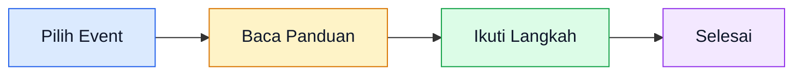

<FeatureSlider />

## Daftar Event Tersedia

 PPDGS USU

<strong>Program Pendidikan Dokter Gigi Spesialis</strong> 
Fakultas Kedokteran Gigi Universitas Sumatera Utara  
 <a href="/ppdgs/persiapan">Baca Panduan →</a> 
 <a href="/ppdgs/faq">FAQ</a> ·  <a href="/hubungi-admin">Hubungi Kami</a>  
<a href="https://lentera.puspenkomusu.com" target="_blank" class="cta-button-inline">
  <svg width="16" height="16" viewBox="0 0 24 24" fill="none" stroke="currentColor" stroke-width="2.5" stroke-linecap="round" stroke-linejoin="round"><path d="M18 13v6a2 2 0 0 1-2 2H5a2 2 0 0 1-2-2V8a2 2 0 0 1 2-2h6"/><polyline points="15 3 21 3 21 9"/><line x1="10" y1="14" x2="21" y2="3"/></svg>
  Buka Aplikasi Lentera
</a>

 PPDS USU

<strong>Program Pendidikan Dokter Spesialis</strong> 
Fakultas Kedokteran Universitas Sumatera Utara  
 <a href="/ppds/persiapan">Baca Panduan →</a> 
 <a href="/ppds/faq">FAQ</a> ·  <a href="/hubungi-admin">Hubungi Kami</a>  
<a href="https://lentera.puspenkomusu.com" target="_blank" class="cta-button-inline">
  <svg width="16" height="16" viewBox="0 0 24 24" fill="none" stroke="currentColor" stroke-width="2.5" stroke-linecap="round" stroke-linejoin="round"><path d="M18 13v6a2 2 0 0 1-2 2H5a2 2 0 0 1-2-2V8a2 2 0 0 1 2-2h6"/><polyline points="15 3 21 3 21 9"/><line x1="10" y1="14" x2="21" y2="3"/></svg>
  Buka Aplikasi Lentera
</a>

 Instalasi SEB (Windows & macOS)

<strong>Panduan Instalasi Perangkat Tes Psikologi</strong> 
Safe Exam Browser wajib diinstal sebelum tes — panduan untuk Windows dan macOS  
 <a href="/instalasi-seb/">Lihat Panduan Instalasi →</a> 
 <a href="/instalasi-seb/instalasi-windows">Windows</a> ·  <a href="/instalasi-seb/instalasi-macos">macOS</a> ·  <a href="/instalasi-seb/penggunaan">Troubleshooting</a>

📅 Event Lainnya

<em>Belum tersedia. Panduan untuk event lain akan ditambahkan kemudian.</em>

## Struktur URL Berdasarkan Event

Setiap event memiliki URL sendiri:

| Event | URL |
|-------|-----|
| **PPDGS USU** | `/ppdgs/` |
| **PPDS USU** | `/ppds/` |
| Event Mendatang | `/event-b/` |
| Event Mendatang | `/event-c/` |

## Cara Membaca Panduan

1. Pilih event dari daftar di atas
2. Ikuti panduan langkah demi langkah
3. Gunakan fitur pencarian jika perlu
4. Hubungi admin jika ada pertanyaan

## Butuh Bantuan?

Kunjungi halaman [Hubungi Kami](/hubungi-admin) untuk mendapatkan bantuan.

Sudah siap mendaftar? Langsung menuju aplikasi:

<a href="https://lentera.puspenkomusu.com" target="_blank" class="cta-button">
  <svg width="20" height="20" viewBox="0 0 24 24" fill="none" stroke="currentColor" stroke-width="2.5" stroke-linecap="round" stroke-linejoin="round"><path d="M18 13v6a2 2 0 0 1-2 2H5a2 2 0 0 1-2-2V8a2 2 0 0 1 2-2h6"/><polyline points="15 3 21 3 21 9"/><line x1="10" y1="14" x2="21" y2="3"/></svg>
  Buka Aplikasi Lentera
</a>

