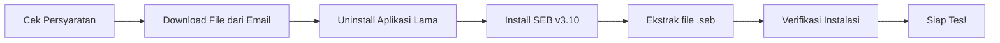

# Panduan Instalasi Perangkat Tes Psikologi

Panduan ini berisi persyaratan perangkat, unduhan, dan langkah instalasi aplikasi yang **wajib dilakukan** sebelum hari pelaksanaan tes psikologi. Ikuti setiap langkah secara berurutan.

---

## Persyaratan Perangkat

⚠️ Spesifikasi Minimum Komputer

<ul>
  <li><strong>Sistem Operasi:</strong> Windows 7, 8, 8.1, atau 10 (64-bit)</li>
  <li><strong>Prosesor:</strong> Minimal Intel Core i3 1 GHz atau setara</li>
  <li><strong>RAM:</strong> Minimal <strong>8 GB</strong></li>
  <li><strong>Layar:</strong> Minimal 13 inch</li>
  <li><strong>Webcam & Mikrofon:</strong> Berfungsi dengan baik</li>
  <li><strong>Penyimpanan:</strong> Tersedia ruang kosong minimal 1 GB</li>
  <li><strong>Koneksi Internet:</strong> Stabil, minimal 10 Mbps</li>
</ul>

📱 Perangkat Tambahan

<ul>
  <li><strong>Smartphone</strong> dengan aplikasi <strong>WhatsApp</strong> dan <strong>Zoom</strong> terinstal — sebagai alat komunikasi alternatif dengan panitia</li>
  <li>Pastikan kuota internet mencukupi (minimal 4 GB) atau gunakan WiFi yang stabil</li>
</ul>

---

## Download File

Unduh **kedua file** berikut untuk memulai instalasi:

📦 File 1: P3M-Addon.zip

<ul>
  <li><strong>Isi:</strong> Aplikasi SEB v3.10</li>
  <li><strong>Ukuran:</strong> ~334 MB</li>
  <li><a href="https://drive.google.com/file/d/1ZbS9EoMto0wsPQaZs6pbAKXhz5resOW3/view?usp=drive_link" target="_blank">⬇️ Download P3M-Addon.zip</a></li>
</ul>

📦 File 2: P3MUSU-App.zip

<ul>
  <li><strong>Isi:</strong> File konfigurasi P3MUSU-App.seb</li>
  <li><strong>Ukuran:</strong> ~4 KB</li>
  <li><a href="https://drive.google.com/file/d/1J9abwGw7B0t1BhM_bJcDE8kDSxRmVAgS/view?usp=drive_link" target="_blank">⬇️ Download P3MUSU-App.zip</a></li>
</ul>

> **PENTING:** Instal aplikasi **HANYA** dari tautan di halaman ini. Jika Anda sudah memiliki aplikasi SEB versi lain, WAJIB uninstall terlebih dahulu.

---

## Ringkasan Langkah Instalasi

| Langkah | Kegiatan | Detail |
|---------|----------|--------|
| 1 | Uninstall aplikasi lama | Zoom, Skype, Cisco Webex (jika ada) |
| 2 | Ekstrak P3M-Addon.zip | Ambil file SEB_v3.10.exe |
| 3 | Install SEB v3.10 | Jalankan installer, ikuti wizard |
| 4 | Ekstrak P3MUSU-App.zip | Letakkan .seb di Desktop |
| 5 | Verifikasi | Jalankan .seb, pastikan form login muncul |
| 6 | Siap tes! | Hubungi panitia jika ada kendala |

---

## Persiapan Sebelum Instalasi

⚡ Persiapan

<ul>
  <li>Pastikan komputer memiliki <strong>hak akses administrator</strong></li>
  <li>Matikan sementara <strong>antivirus</strong> jika menghambat proses instalasi</li>
  <li>Koneksi internet <strong>stabil</strong> selama proses download</li>
  <li>Baterai laptop <strong>terisi penuh</strong> atau sambungkan ke listrik</li>
</ul>

### Persiapan Ruangan (Saat Tes)

🪑 Pengaturan Ruangan

<ul>
  <li>Siapkan <strong>meja dan kursi</strong> dengan latar belakang <strong>tembok</strong>, jarak tidak lebih dari 2 meter</li>
  <li>Meja harus <strong>bersih</strong> dari barang selain laptop dan alat tulis (pena/pensil dan kertas)</li>
  <li>Ruangan tes harus memiliki <strong>pencahayaan yang terang</strong></li>
  <li>Pastikan laptop terhubung dengan <strong>daya yang stabil</strong> (UPS atau baterai penuh)</li>
</ul>

---

## Ada Masalah?

Jika mengalami kendala saat instalasi, hubungi **technical support** melalui **WhatsApp** (sertakan screenshot masalah) pada pukul 10.00 – 17.00 WIB, atau melalui halaman [Hubungi Kami](/hubungi-admin).

[⬇️ Lanjut ke Panduan Instalasi Windows →](/instalasi-seb/instalasi-windows)
