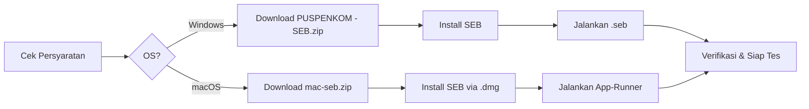

# Panduan Instalasi Perangkat Tes Psikologi

Panduan ini berisi persyaratan perangkat, unduhan, dan langkah instalasi aplikasi yang **wajib dilakukan** sebelum hari pelaksanaan tes psikologi. Ikuti setiap langkah secara berurutan.

---

## Persyaratan Perangkat

⚠️ Spesifikasi Minimum Komputer

<ul>
  <li><strong>Sistem Operasi:</strong> Windows 7, 8, 8.1, atau 10 (64-bit) <em>atau</em> macOS 11 (Big Sur)+</li>
  <li><strong>Prosesor:</strong> Minimal Intel Core i3 1 GHz atau setara</li>
  <li><strong>RAM:</strong> Minimal <strong>8 GB</strong></li>
  <li><strong>Layar:</strong> Minimal 13 inch</li>
  <li><strong>Webcam & Mikrofon:</strong> Berfungsi dengan baik</li>
  <li><strong>Penyimpanan:</strong> Tersedia ruang kosong minimal 1 GB</li>
  <li><strong>Koneksi Internet:</strong> Stabil, minimal 10 Mbps</li>
</ul>

📱 Perangkat Tambahan

<ul>
  <li><strong>Smartphone</strong> dengan aplikasi <strong>WhatsApp</strong> dan <strong>Zoom</strong> terinstal — sebagai alat komunikasi alternatif dengan panitia</li>
  <li>Pastikan kuota internet mencukupi (minimal 4 GB) atau gunakan WiFi yang stabil</li>
</ul>

---

## Download SEB

Safe Exam Browser (SEB) tersedia untuk **Windows** dan **macOS**. Pilih file sesuai sistem operasi Anda:

ℹ️ SEB Mendukung Windows & macOS

Peserta pengguna <strong>Windows</strong> lanjut ke card Windows di bawah. Peserta pengguna <strong>macOS</strong> (Intel & Apple Silicon M1/M2/M3) lanjut ke card macOS.

 Download SEB — Windows

<strong>File:</strong> PUSPENKOM - SEB.zip (~334 MB)

<ul>
  <li><strong>Isi:</strong> Aplikasi SEB + File konfigurasi (.seb)</li>
  <li><a href="https://drive.google.com/file/d/1rP19a57WOEn3DAV3PW9Q8InSDpz1EclI/view?usp=drive_link" target="_blank">⬇️ Download PUSPENKOM - SEB.zip</a></li>
</ul>

 Download SEB — macOS

<strong>file:</strong> mac-seb.zip (~14 MB)

<ul>
  <li><strong>Isi:</strong> Installer SEB + App-Runner + file .seb</li>
  <li><a href="https://drive.google.com/file/d/1QX9qKeT2vcNboNfX5E04mEhZfCrt9yer/view?usp=drive_link" target="_blank">⬇️ Download mac-seb.zip</a></li>
</ul>

> **PENTING:** Instal aplikasi **HANYA** dari tautan di halaman ini. Jika Anda sudah memiliki aplikasi SEB versi lain, WAJIB uninstall terlebih dahulu.

---

## Ringkasan Langkah Instalasi

| Langkah | Windows | macOS |
|---------|---------|-------|
| 1 | Uninstall aplikasi lama (Zoom, Skype, dll) | Uninstall aplikasi lama (Zoom, Skype, dll) |
| 2 | Download & ekstrak PUSPENKOM - SEB.zip | Ekstrak mac-seb.zip → SafeExamBrowser-3.6.1.dmg |
| 3 | Jalankan installer SEB_v3.10.1.864.exe | Buka .dmg → drag SEB ke Applications |
| 4 | Pindahkan file .seb ke Desktop | Ekstrak P3MUSU-App.zip → .seb di Desktop |
| 5 | Verifikasi: jalankan file .seb | Jalankan App-Runner → izinkan Gatekeeper |
| 6 | Siap tes! | Siap tes! |

---

## Persiapan Sebelum Instalasi

⚡ Persiapan

<ul>
  <li>Pastikan komputer memiliki <strong>hak akses administrator</strong></li>
  <li>Matikan sementara <strong>antivirus</strong> jika menghambat proses instalasi</li>
  <li>Koneksi internet <strong>stabil</strong> selama proses download</li>
  <li>Baterai laptop <strong>terisi penuh</strong> atau sambungkan ke listrik</li>
</ul>

### Persiapan Ruangan (Saat Tes)

🪑 Pengaturan Ruangan

<ul>
  <li>Siapkan <strong>meja dan kursi</strong> dengan latar belakang <strong>tembok</strong>, jarak tidak lebih dari 2 meter</li>
  <li>Meja harus <strong>bersih</strong> dari barang selain laptop dan alat tulis (pena/pensil dan kertas)</li>
  <li>Ruangan tes harus memiliki <strong>pencahayaan yang terang</strong></li>
  <li>Pastikan laptop terhubung dengan <strong>daya yang stabil</strong> (UPS atau baterai penuh)</li>
</ul>

---

## Ada Masalah?

Jika mengalami kendala saat instalasi, hubungi **technical support** melalui **WhatsApp** (sertakan screenshot masalah) pada pukul 10.00 – 17.00 WIB, atau melalui halaman [Hubungi Kami](/hubungi-admin).

Pilih panduan sesuai sistem operasi Anda:

| OS | Panduan Lengkap |
|----|----------------|
|  Windows | [⬇️ Panduan Instalasi Windows →](/instalasi-seb/instalasi-windows) |
|  macOS | [⬇️ Panduan Instalasi macOS →](/instalasi-seb/instalasi-macos) |
