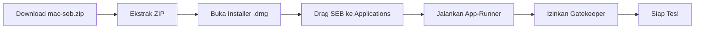

# Instalasi Perangkat Tes Psikologi — macOS

Panduan ini untuk peserta yang menggunakan **macOS** (Intel & Apple Silicon M1/M2/M3). Ikuti langkah-langkah di bawah secara **berurutan**.

---

## 1. Persyaratan Sistem

| Komponen | Minimum |
|----------|---------|
| OS | macOS 11 (Big Sur) atau lebih baru |
| RAM | **4 GB** |
| Penyimpanan | 200 MB free space |
| Koneksi | Internet stabil, minimal 10 Mbps |
| Webcam & Mikrofon | Berfungsi dengan baik |
| Kompatibilitas | Intel & Apple Silicon (M1/M2/M3) |

---

## 2. Download File

Unduh file **`mac-seb.zip`** dari tautan berikut:

| File | Isi | Ukuran |
|------|-----|--------|
| [`mac-seb.zip`](https://drive.google.com/file/d/1QX9qKeT2vcNboNfX5E04mEhZfCrt9yer/view?usp=drive_link) | Installer SEB + App-Runner | ~14 MB |

Simpan file di lokasi yang mudah ditemukan (misalnya folder **Downloads**).

---

## 3. Langkah 1: Ekstrak ZIP

1. Cari file `mac-seb.zip` yang sudah diunduh
2. Klik dua kali file ZIP — macOS akan otomatis mengekstraknya
3. Folder hasil ekstrak akan muncul dengan nama `mac-seb`

---

## 4. Langkah 2: Buka Folder Hasil Ekstrak

Buka folder hasil ekstrak untuk mengakses file instalasi.

---

## 5. Langkah 3: Buka Installer

Klik dua kali file **`SafeExamBrowser-3.6.1.dmg`** untuk memulai instalasi.

---

## 6. Langkah 4: Install SEB

1. Setelah file `.dmg` terbuka, akan muncul jendela berisi ikon **Safe Exam Browser**
2. **Drag** ikon SEB ke folder **Applications**

3. Tunggu hingga proses copy selesai
4. SEB sekarang terinstal di folder Applications

---

## 7. Langkah 5: Jalankan App-Runner

1. Kembali ke folder hasil ekstrak (`mac-seb`)
2. Klik dua kali **`App-Runner`**

---

## 8. Langkah 6: Konfirmasi Keamanan macOS

Saat pertama kali menjalankan, macOS akan menampilkan **dialog konfirmasi keamanan** karena aplikasi ini tidak berasal dari App Store.

Klik **Open** atau **Buka** untuk melanjutkan.

Safe Exam Browser akan terbuka secara otomatis dan environment tes siap digunakan.

> **Catatan:** Jika dialog tidak muncul, buka **System Settings → Privacy & Security** — cari pemberitahuan terkait Safe Exam Browser, lalu klik **Open Anyway**.

---

## 9. Selesai

Setelah semua langkah di atas selesai, Safe Exam Browser (SEB) akan terbuka secara otomatis dan lingkungan ujian (aplikasi CBT) siap digunakan ✅

---

## Troubleshooting — macOS

| Masalah | Solusi |
|---------|--------|
| File ZIP tidak bisa diekstrak | Pastikan file terunduh sempurna. Coba download ulang. |
| "SEB cannot be opened because the developer cannot be verified" | Buka **System Settings → Privacy & Security** → cari pemberitahuan SEB → klik **Open Anyway** |
| App-Runner tidak bisa dibuka | Pastikan SEB sudah terinstal di folder Applications |
| SEB tidak merespon setelah dibuka | Force quit (Cmd+Option+Esc), jalankan ulang App-Runner |
| Error "damaged" pada .dmg | Download ulang file `mac-seb.zip` dan ekstrak ulang |
| Form login tidak muncul | Pastikan koneksi internet aktif. Coba jalankan ulang App-Runner. |

Untuk masalah lain, hubungi **technical support** via **WhatsApp** (sertakan screenshot) pukul 10.00 – 17.00 WIB, atau melalui halaman [Hubungi Kami](/hubungi-admin).
