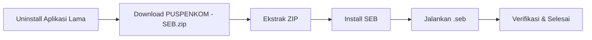

# Instalasi Perangkat Tes Psikologi — Windows

Panduan ini untuk peserta yang menggunakan **Windows 10 atau 11**. Ikuti langkah-langkah di bawah secara **berurutan**.

---

## 1. Persyaratan Sistem

| Komponen | Minimum |
|----------|---------|
| OS | Windows 10 atau 11 (64-bit) |
| Prosesor | Intel Core i3 1 GHz atau setara |
| RAM | **8 GB** |
| Layar | 13 inch |
| Penyimpanan | 1 GB free space |
| Koneksi | Internet stabil, minimal 10 Mbps |
| Webcam & Mikrofon | Berfungsi dengan baik |
| Hak Akses | Administrator (untuk instalasi) |

---

## 2. Download File

Unduh file berikut dari halaman [Panduan Instalasi](/instalasi-seb/):

| File | Isi | Ukuran |
|------|-----|--------|
| [`PUSPENKOM - SEB.zip`](https://drive.google.com/file/d/1rP19a57WOEn3DAV3PW9Q8InSDpz1EclI/view?usp=drive_link) | Aplikasi SEB + File konfigurasi | ~334 MB |

Simpan file di lokasi yang mudah ditemukan (misalnya folder **Downloads**).

::: warning
File ini berukuran besar (~334 MB). Pastikan koneksi internet stabil selama proses download. Jika terputus, lanjutkan download atau ulangi dari awal.
:::

---

## 3. Uninstall Aplikasi yang Bertentangan

> **PENTING:** Jika komputer Anda memiliki aplikasi **Zoom Meeting**, **Skype**, atau **Cisco Webex** yang sudah terinstal, WAJIB uninstall terlebih dahulu.

**Cara uninstall:**
1. Buka **Control Panel** → **Programs and Features** (atau **Settings** → **Apps** di Windows 10)
2. Cari **Zoom**, **Skype**, atau **Cisco Webex** di daftar
3. Klik kanan → pilih **Uninstall**
4. Ikuti wizard hingga selesai

---

## 4. Ekstrak PUSPENKOM - SEB.zip

1. Cari file `PUSPENKOM - SEB.zip` yang sudah diunduh
2. Klik kanan → pilih **Extract All...** (bawaan Windows) atau gunakan WinRAR / 7-Zip
3. Tentukan lokasi ekstrak (biarkan default atau pilih folder yang mudah diakses)
4. Klik **Extract** dan tunggu hingga selesai
5. Setelah selesai, akan muncul folder baru berisi:
   - `SEB_3.10.1.864_SetupBundle.exe` — Installer SEB
   - `puspenkom-config.seb` — File konfigurasi tes

---

## 5. Install SEB

1. Buka folder hasil ekstrak, klik dua kali file **`SEB_3.10.1.864_SetupBundle.exe`**

   

2. Ikuti wizard instalasi:
   - **Welcome** → klik **Next**
   - **License Agreement** → centang **I accept...** → klik **Next**
   - **Ready to Install** → klik **Install**

3. Tunggu proses instalasi hingga selesai

   

4. Klik **Close** — SEB sekarang terinstal

   

---

## 6. Siapkan File Konfigurasi

File `puspenkom-config.seb` sudah tersedia di folder hasil ekstrak. **Pindahkan** atau **salin** file tersebut ke **Desktop** agar mudah diakses saat tes.

::: tip
Simpan file `.seb` di Desktop karena Anda akan mengkliknya saat tes dimulai.
:::

---

## 7. Verifikasi Instalasi

1. Pastikan komputer terhubung ke **internet**
2. Klik dua kali file **`puspenkom-config.seb`** di Desktop

   

3. SEB akan terbuka dan menampilkan **form login aplikasi CBT**

   

4. Jika form login muncul, instalasi **berhasil** ✅
5. Klik ikon **Quit SEB** (pojok kanan bawah) untuk keluar

---

## Troubleshooting

| Masalah | Solusi |
|---------|--------|
| File ZIP tidak bisa diekstrak | Pastikan file terunduh sempurna. Coba download ulang. |
| Installer tidak bisa dibuka | Klik kanan → **Run as Administrator** |
| Antivirus memblokir SEB | Tambahkan SEB ke daftar **exception** antivirus. Matikan sementara antivirus jika perlu. |
| File .seb tidak ditemukan | File `puspenkom-config.seb` ada di dalam folder hasil ekstrak `PUSPENKOM - SEB.zip`. |
| SEB error "Corrupt config file" | Download ulang file `PUSPENKOM - SEB.zip` dan ekstrak ulang. |
| Form login tidak muncul | Pastikan koneksi internet aktif. Coba klik ganda file `puspenkom-config.seb` kembali. |

Untuk masalah lain, hubungi **technical support** via **WhatsApp** (sertakan screenshot) pukul 10.00 – 17.00 WIB, atau melalui halaman [Hubungi Kami](/hubungi-admin).
