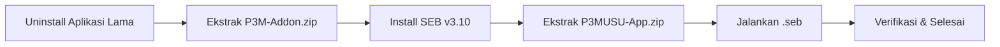

# Instalasi Perangkat Tes Psikologi — Windows

Panduan ini untuk peserta yang menggunakan **Windows 7, 8, 8.1, atau 10**. Ikuti langkah-langkah di bawah secara **berurutan**.

---

## 1. Persyaratan Sistem

| Komponen | Minimum |
|----------|---------|
| OS | Windows 7, 8, 8.1, atau 10 (64-bit) |
| Prosesor | Intel Core i3 1 GHz atau setara |
| RAM | **8 GB** |
| Layar | 13 inch |
| Penyimpanan | 1 GB free space |
| Koneksi | Internet stabil, minimal 10 Mbps |
| Webcam & Mikrofon | Berfungsi dengan baik |
| Hak Akses | Administrator (untuk instalasi) |

---

## 2. Download File

Unduh **kedua file** berikut dari halaman [Panduan Instalasi](/instalasi-seb/):

| File | Isi | Ukuran |
|------|-----|--------|
| `P3M-Addon.zip` | Aplikasi SEB v3.10 | ~334 MB |
| `P3MUSU-App.zip` | File konfigurasi .seb | ~4 KB |

Simpan kedua file di lokasi yang mudah ditemukan (misalnya folder **Downloads**).

---

## 3. Uninstall Aplikasi yang Bertentangan

> **PENTING:** Jika komputer Anda memiliki aplikasi **Zoom Meeting**, **Skype**, atau **Cisco Webex** yang sudah terinstal, WAJIB uninstall terlebih dahulu.

**Cara uninstall:**
1. Buka **Control Panel** → **Programs and Features** (atau **Settings** → **Apps** di Windows 10)
2. Cari **Zoom**, **Skype**, atau **Cisco Webex** di daftar
3. Klik kanan → pilih **Uninstall**
4. Ikuti wizard hingga selesai

---

## 4. Ekstrak P3M-Addon.zip

1. Cari file `P3M-Addon.zip` yang sudah diunduh
2. Klik kanan → pilih **Extract All...** (bawaan Windows) atau gunakan WinRAR / 7-Zip / WinZip
3. Tentukan lokasi ekstrak (biarkan default atau pilih folder yang mudah diakses)
4. Klik **Extract** dan tunggu hingga selesai
5. Setelah selesai, akan muncul folder baru berisi file `SEB_v3.10.exe`

---

## 5. Install SEB v3.10

1. Buka folder hasil ekstrak, klik dua kali file **`SEB_v3.10.exe`**

   

2. Akan muncul jendela **Welcome to Safe Exam Browser** → klik **Next**

   

3. Baca lisensi, klik **I accept the terms...** → klik **Next**

   

4. Akan muncul jendela **Ready to Install the Program** → klik **Install**

   

5. Tunggu proses instalasi hingga selesai

   

6. Klik **Finish** — SEB v3.10 sekarang terinstal

   

---

## 6. Ekstrak P3MUSU-App.zip

1. Cari file `P3MUSU-App.zip` yang sudah diunduh
2. Ekstrak isinya — kami sarankan ekstrak ke **Desktop** agar mudah diakses saat tes
3. Setelah diekstrak, akan muncul file **`p3musu.seb`** di Desktop

---

## 7. Verifikasi Instalasi

1. Pastikan komputer terhubung ke **internet**
2. Klik dua kali file **`p3musu.seb`** di Desktop
3. SEB akan terbuka dan menampilkan **form login aplikasi CBT**

   

4. Jika form login muncul, instalasi **berhasil** ✅
5. Klik ikon **Quit SEB** (pojok kanan bawah) untuk keluar

---

## Troubleshooting

| Masalah | Solusi |
|---------|--------|
| File ZIP tidak bisa diekstrak | Pastikan file terunduh sempurna. Coba download ulang. |
| Installer tidak bisa dibuka | Klik kanan → **Run as Administrator** |
| Antivirus memblokir SEB | Tambahkan SEB ke daftar **exception** antivirus. Matikan sementara antivirus jika perlu. |
| File .seb tidak muncul setelah ekstrak | Pastikan Anda mengekstrak `P3MUSU-App.zip`, bukan file lain. |
| SEB error "Corrupt config file" | Download ulang file `P3MUSU-App.zip` dan ekstrak ulang. |
| Form login tidak muncul | Pastikan koneksi internet aktif. Coba jalankan ulang file .seb. |

Untuk masalah lain, hubungi **technical support** via **WhatsApp** (sertakan screenshot) pukul 10.00 – 17.00 WIB, atau melalui halaman [Hubungi Kami](/hubungi-admin).
