# Tiket Bantuan

Gunakan fitur **Tiket Bantuan** di aplikasi Lentera untuk menghubungi admin jika mengalami kendala. Semua pesan akan diteruskan ke tim admin dan akan direspon sesuai jam operasional.

```mermaid
flowchart LR
    A[Login Lentera] --> B[Klik Menu Tiket Bantuan]
    B --> C[Klik Tambah Data]
    C --> D[Isi Form Tiket]
    D --> E[Kirim Tiket]
    E --> F[Admin Merespon]
    F --> G[Masalah Selesai]

    style A fill:#dbeafe,stroke:#2563eb,color:#0f172a
    style B fill:#fef3c7,stroke:#d97706,color:#0f172a
    style C fill:#dcfce7,stroke:#16a34a,color:#0f172a
    style D fill:#f3e8ff,stroke:#9333ea,color:#0f172a
    style E fill:#fce7f3,stroke:#db2777,color:#0f172a
    style F fill:#fef3c7,stroke:#d97706,color:#0f172a
    style G fill:#dcfce7,stroke:#16a34a,color:#0f172a
```

## Cara Mengakses Tiket Bantuan

1. Login ke aplikasi Lentera di [https://lentera.puspenkomusu.com](https://lentera.puspenkomusu.com)
2. Di sidebar sebelah kiri, cari menu **Tiket Bantuan** 
3. Klik menu tersebut untuk masuk ke halaman Daftar Tiket Bantuan

::: tip
Menu Tiket Bantuan terletak di sidebar, di bawah menu **Daftar Event** dan di atas menu **Pembayaran**.
:::

## Membuat Tiket Baru

1. Klik tombol **Tambah Data** (tombol biru di pojok kanan atas)
2. Isi form yang muncul:

### Field yang Harus Diisi

| Field | Tipe | Keterangan |
|-------|------|-----------|
| **Subjek / Judul** | Teks | Judul singkat masalah yang Anda alami |
| **Kategori** | Pilihan | Pilih jenis masalah (lihat tabel di bawah) |
| **Prioritas** | Pilihan | Seberapa mendesak masalah Anda |
| **Lampiran** | Upload | Foto/dokumen pendukung (opsional) |
| **Detail Masalah** | Teks panjang | Penjelasan lengkap kendala yang dialami |

3. Setelah semua terisi, klik **Kirim Tiket**

## Kategori Tiket

Pilih kategori yang paling sesuai dengan masalah Anda:

| Kategori | Untuk Masalah | Contoh |
|----------|--------------|--------|
| **Masalah Teknis** | Error aplikasi, bug, gangguan sistem | Tidak bisa login, halaman error, fitur tidak berfungsi |
| **Pertanyaan Umum** | Informasi umum, cara penggunaan | Cara mendaftar event, cara mengubah profil |
| **Billing / Pembayaran** | Kendala pembayaran, invoice | Pembayaran gagal, bukti transfer tidak terbaca |

## Prioritas Tiket

| Prioritas | Keterangan | Kapan Digunakan |
|-----------|-----------|-----------------|
| **High (Darurat)** | Sangat mendesak | Menghambat proses pendaftaran/tes sepenuhnya |
| **Medium (Biasa)** | Perlu ditindak segera | Ada kendala tapi masih bisa menunggu |
| **Low (Tidak Mendesak)** | Bisa ditunda | Pertanyaan umum atau saran perbaikan |

## Lampiran

Anda bisa melampirkan file pendukung seperti screenshot error atau dokumen terkait.

::: warning
- **Ukuran maksimum:** 2MB per file
- **Format yang didukung:** JPG, PNG, PDF, DOCX, ZIP
:::

## Status Tiket

Setelah mengirim tiket, Anda bisa memantau statusnya di halaman Daftar Tiket Bantuan:

| Status | Arti | Penjelasan |
|--------|------|-----------|
| **Open** | Baru | Tiket baru dikirim, belum ditangani admin |
| **In Progress** | Diproses | Admin sedang menangani tiket Anda |
| **Resolved** | Selesai | Masalah sudah dijawab atau diselesaikan |
| **Closed** | Ditutup | Tiket sudah ditutup dan tidak ada tindak lanjut |

## Tips Mengirim Tiket

::: tip
- **Jelaskan masalah dengan jelas** — Sertakan kronologi kejadian
- **Sertakan screenshot** — Lampirkan bukti error atau kendala
- **Pilih kategori yang tepat** — Mempercepat proses penanganan
- **Pilih prioritas sesuai kondisi** — Jangan semua tiket diatur "High"
- **Cantumkan data diri** — Nama lengkap dan nomor registrasi jika sudah terdaftar
:::

::: danger
Jangan mengirim tiket dengan:
- Pesan kosong atau tidak jelas
- Spam atau tiket berulang-ulang untuk masalah yang sama
- Bahasa yang tidak sopan
:::

## Contoh Mengisi Tiket

### Contoh 1: Masalah Teknis

> **Subjek:** Error saat upload foto profil
>
> **Kategori:** Masalah Teknis
>
> **Prioritas:** Medium (Biasa)
>
> **Detail:**
> Saya mencoba upload foto profil ukuran 500KB format JPG, namun muncul error "File terlalu besar". Padahal ukuran sudah di bawah 2MB. Saya sudah mencoba dengan foto lain tetapi hasilnya sama.

### Contoh 2: Pertanyaan Umum

> **Subjek:** Cara mengubah jadwal konseling
>
> **Kategori:** Pertanyaan Umum
>
> **Prioritas:** Low (Tidak Mendesak)
>
> **Detail:**
> Saya ingin mengubah jadwal konseling yang sudah terdaftar dari hari Selasa ke hari Rabu. Mohon bantuannya, terima kasih.

## Yang Harus Disiapkan Sebelum Mengirim Tiket

1. **Nama Lengkap** sesuai registrasi
2. **Nomor Registrasi** (jika sudah mendaftar)
3. **Deskripsi Masalah** yang jelas
4. **Screenshot** error atau kendala (jika ada)
5. **Lampiran pendukung** lainnya (jika perlu)

## Jam Operasional Admin

| Hari | Jam | Keterangan |
|------|-----|-----------|
| Senin - Kamis | 08.00 - 16.00 WIB | Buka |
| Jumat | 08.00 - 16.30 WIB | Buka |
| Sabtu | 08.00 - 12.00 WIB | Buka (terbatas) |
| Minggu & Libur Nasional | - | Tutup |

::: warning
Pertanyaan yang masuk di luar jam operasional akan dijawab pada jam kerja berikutnya.
:::

## Alternatif Lain: Hubungi Admin

Jika Anda lebih nyaman menghubungi admin langsung, bisa melalui:

- **WhatsApp:** [+62 811-6570-511](https://wa.me/628116570511) (sesuai jam operasional)
- **Email:** p3m@usu.ac.id (subjek: `[kode event] - topik masalah`)

Lihat panduan lengkap di halaman [Hubungi Kami](/hubungi-admin).
