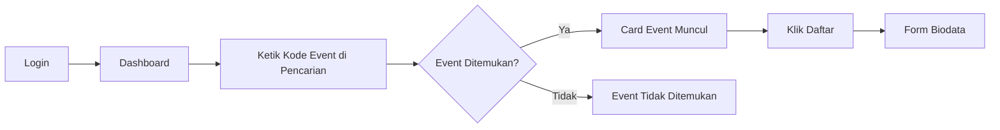

# Dashboard Peserta

Dashboard adalah halaman utama yang Anda lihat setelah login. Dari sini Anda dapat mencari event MANSOSKUL menggunakan kode event yang dibagikan oleh panitia.

## Tampilan Dashboard

Setelah login, Anda akan langsung melihat halaman dashboard. Di dashboard terdapat **kolom pencarian** (search bar) untuk mencari event MANSOSKUL.

## Mencari Event MANSOSKUL

1. Di dashboard, cari **kolom pencarian** (search bar) di bagian atas
2. Ketik **nama event** atau **kode event** MANSOSKUL yang dibagikan oleh panitia
3. Jika kode event cocok, akan muncul **card event** yang berisi informasi event tersebut

### Informasi di Card Event

| Informasi | Keterangan |
|-----------|-----------|
| Nama Event | MANSOSKUL |
| Tanggal Pelaksanaan | Tergantung jadwal |
| Lokasi | Tergantung jadwal |
| Deskripsi | Informasi singkat tentang event |
| Tombol **Daftar** | Klik untuk mendaftar |

 Penting

Kode event MANSOSKUL dibagikan secara eksklusif oleh panitia. Jika Anda belum memiliki kode event, hubungi panitia melalui [Hubungi Kami](/hubungi-admin).

## Notifikasi di Dashboard

 Notifikasi

Update terbaru tentang pendaftaran Anda akan muncul di bagian atas dashboard. Periksa secara berkala.

 Status

Setiap perubahan status pendaftaran akan langsung terlihat di dashboard.

## Status Pendaftaran

| Status | Keterangan |
|--------|-----------|
| Draft | Pendaftaran belum lengkap |
| Belum Lengkap | Ada data yang masih harus diisi |
| Disetujui | Pendaftaran diterima |
| Ditolak | Ada data yang perlu diperbaiki |
| Selesai | Semua proses selesai |

## Langkah Selanjutnya

Dari dashboard Anda dapat:

- [Mencari dan mendaftar event](/mansoskul/mendaftar-event) dengan mengetik kode event
- [Melengkapi biodata](/mansoskul/form-biodata) setelah mendaftar

 Tips

- Simpan kode event MANSOSKUL yang diberikan panitia
- Periksa dashboard setiap hari untuk melihat update terbaru
- Segera lengkapi data yang diminta
- Hubungi admin jika ada kendala

