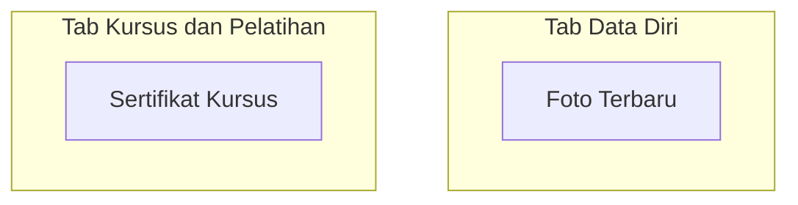

# Daftar Dokumen Wajib

Halaman ini berisi daftar dokumen yang diperlukan untuk pendaftaran MANSOSKUL.

## Dokumen

Semua dokumen diupload langsung di dalam tab formulir pendaftaran.

### 1. Foto Terbaru

| Detail | Keterangan |
|--------|-----------|
| Upload di Tab | Data Diri |
| Format | JPG |
| Ukuran Maksimal | 1 MB |
| Resolusi Maksimal | 2500 x 1600 px |
| Ketentuan | Foto formal, latar belakang merah, menghadap depan, pakaian rapi |

### 2. Sertifikat Kursus / Pelatihan (Opsional)

| Detail | Keterangan |
|--------|-----------|
| Upload di Tab | Kursus dan Pelatihan |
| Format | JPG |
| Ukuran Maksimal | 1 MB |
| Resolusi Maksimal | 2500 x 1600 px |
| Ketentuan | Scan jelas sertifikat kursus, pelatihan, atau workshop |

## Ringkasan Dokumen

| No | Dokumen | Upload di | Format | Ukuran Maks | Wajib? |
|----|---------|-----------|--------|-------------|--------|
| 1 | Foto Terbaru | Tab Data Diri | JPG | 1 MB | Ya |
| 2 | Sertifikat Kursus | Tab Kursus dan Pelatihan | JPG | 1 MB | Tidak |

## Ketentuan Umum Upload

 Ketentuan File

Seluruh dokumen berformat **JPG** wajib memenuhi ketentuan berikut:
- **Format**: JPG (JPEG)
- **Ukuran Maksimal**: 1 MB per file
- **Resolusi Maksimal**: 2500 x 1600 piksel
- **Kualitas**: Jelas, tidak buram, tidak terpotong

## Tips Menyiapkan Dokumen

 Tips Menyiapkan Dokumen

1. **Scan dengan resolusi cukup** - 300 DPI sudah memadai
2. **Beri nama file yang rapi** - Contoh: `Foto_NamaLengkap.jpg`
3. **Kompres jika terlalu besar** - Gunakan aplikasi image compressor
4. **Simpan di cloud** - Google Drive atau Dropbox sebagai cadangan
5. **Periksa kembali** - Pastikan file tidak corrupt sebelum upload

