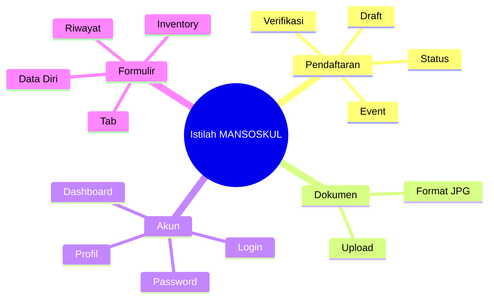

# Istilah-Istilah Pada Sistem

Memahami istilah-istilah yang digunakan dalam aplikasi MANSOSKUL akan membantu Anda menggunakan sistem dengan lebih mudah.

## Istilah Umum

### Aplikasi
Perangkat lunak berbasis web yang digunakan untuk mendaftar event MANSOSKUL.

### Dashboard
Halaman utama setelah login yang menampilkan informasi penting dan menu-menu aplikasi.

### Event
Kegiatan atau program yang dapat didaftar, dalam hal ini MANSOSKUL (Manajemen Organisasi dan Kepemimpinan).

### Kode Event
Kode unik yang dibagikan panitia untuk mencari dan mendaftar event MANSOSKUL.

## Istilah Status Pendaftaran

| Istilah | Arti |
|---------|------|
| **Draft** | Pendaftaran baru dibuat, data belum lengkap |
| **Belum Lengkap** | Masih ada data yang harus diisi |
| **Menunggu Verifikasi** | Semua data sudah dikirim, sedang diperiksa admin |
| **Disetujui** | Pendaftaran diterima dan lolos verifikasi |
| **Ditolak** | Ada data yang tidak sesuai |
| **Selesai** | Seluruh proses pendaftaran telah rampung |

## Istilah Formulir

| Istilah | Arti |
|---------|------|
| **Tab** | Bagian formulir yang dikelompokkan berdasarkan kategori |
| **Data Diri** | Tab berisi informasi pribadi peserta |
| **Riwayat Pekerjaan** | Tab berisi pengalaman kerja |
| **Pengalaman Organisasi** | Tab berisi riwayat organisasi |
| **Kursus dan Pelatihan** | Tab berisi pelatihan yang pernah diikuti |
| **Inventory** | Tab berisi inventori psikologis tentang tanggapan terhadap situasi/masalah |
| **Upload** | Proses mengirim file dari perangkat ke server aplikasi |

## Istilah Akun

| Istilah | Arti |
|---------|------|
| **Registrasi** | Proses pembuatan akun baru |
| **Login** | Proses masuk ke akun yang sudah ada |
| **Logout** | Proses keluar dari akun |
| **Password** | Kata sandi untuk mengamankan akun |
| **Update Password** | Proses mengubah password (wajib bagi pengguna Google) |
| **Reset Password** | Proses mengganti password yang lupa |

## Istilah Teknis

| Istilah | Arti |
|---------|------|
| **Browser** | Program untuk mengakses internet (Chrome, Firefox, Edge) |
| **Cache** | Data sisa browsing yang bisa menyebabkan error |
| **Koneksi** | Hubungan perangkat ke internet |
| **Server** | Komputer pusat yang menjalankan aplikasi |

## Singkatan yang Sering Digunakan

| Singkatan | Kepanjangan |
|-----------|-------------|
| **MANSOSKUL** | Manajemen Organisasi dan Kepemimpinan |
| **USU** | Universitas Sumatera Utara |
| **JPG/JPEG** | Joint Photographic Experts Group |
| **MB** | Megabyte |
| **KB** | Kilobyte |
| **DPI** | Dots Per Inch (resolusi gambar) |
