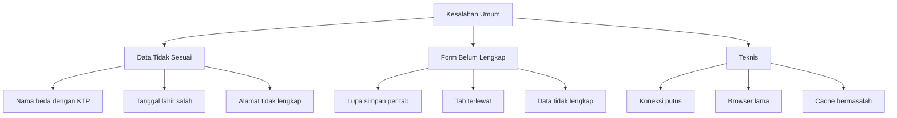

# Kesalahan yang Sering Dilakukan Peserta

Pelajari dari kesalahan umum peserta lain agar pendaftaran MANSOSKUL Anda berjalan lancar.

## Kesalahan Data Diri

### 1. Nama Tidak Sesuai KTP

**Masalah:** Menggunakan nama panggilan atau gelar saat mengisi nama.

**Solusi:** Gunakan nama lengkap sesuai KTP tanpa gelar akademik.

### 2. Tanggal Lahir Salah

**Masalah:** Format tanggal lahir terbalik (bulan-tanggal-tahun).

**Solusi:** Gunakan format YYYY-MM-DD sesuai petunjuk.

### 3. Alamat Tidak Lengkap

**Masalah:** Alamat ditulis singkat, tanpa RT/RW atau kode pos.

**Solusi:** Tulis alamat lengkap sesuai KTP.

## Kesalahan Form

### 4. Lupa Menyimpan Per Tab

**Masalah:** Mengisi data di suatu tab tapi tidak klik **Simpan**, lalu pindah ke tab lain. Data hilang.

**Solusi:** Selalu klik **Simpan** sebelum meninggalkan tab.

### 5. Tab Terlewat

**Masalah:** Melewatkan salah satu tab (misalnya tidak mengisi tab Inventory/Lingkungan Kehidupan).

**Solusi:** Periksa semua tab dari kiri ke kanan secara berurutan sebelum logout.

### 6. Data Tidak Lengkap

**Masalah:** Field wajib ada yang kosong.

**Solusi:** Isi semua field yang tersedia di setiap tab.

## Kesalahan Teknis

### 7. Koneksi Internet Putus Saat Mengisi Form

**Solusi:**
- Gunakan koneksi kabel (LAN) jika memungkinkan
- Simpan data per tab segera setelah selesai mengisi
- Hindari mengisi form di jam sibuk

### 8. Browser Tidak Update

**Solusi:** Gunakan browser versi terbaru (Chrome/Firefox/Edge).

### 9. Cache Bermasalah

**Solusi:** Clear cache browser atau gunakan mode incognito.

### 10. Lupa Password Google

**Solusi:** Jika registrasi via Google dan lupa password yang sudah diupdate, gunakan fitur Lupa Password di halaman login.

## Daftar Periksa Sebelum Submit

Sebelum menyelesaikan pendaftaran, periksa hal berikut:

- [ ] Nama sesuai KTP
- [ ] Tanggal lahir benar
- [ ] Nomor HP aktif
- [ ] Email benar
- [ ] Semua tab terisi (Data Diri, Pekerjaan, Organisasi, Kursus, Inventory/Lingkungan Kehidupan)
- [ ] Setiap tab sudah disimpan
- [ ] Foto sudah diupload (jika diminta)
