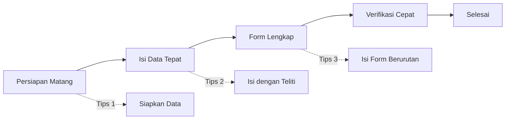

# Tips Agar Pendaftaran Cepat Selesai

Ini tips-tips agar proses pendaftaran MANSOSKUL berjalan lancar dan cepat.

## 1. Siapkan Semua Data Sebelum Mendaftar

Ini adalah tips paling penting! Jangan mulai mendaftar jika data belum siap.

**Lakukan sebelum mulai:**
- [x] Siapkan data diri (KTP, KK)
- [x] Catat riwayat pekerjaan (nama perusahaan, posisi, masa kerja)
- [x] Catat pengalaman organisasi (nama organisasi, posisi, periode)
- [x] Siapkan data kursus dan pelatihan yang pernah diikuti
- [x] Siapkan contoh situasi/masalah nyata yang pernah dihadapi

## 2. Gunakan Laptop atau PC

Meskipun bisa menggunakan HP, proses pengisian form akan lebih mudah di laptop atau PC.

**Keuntungan menggunakan laptop:**
- Layar lebih besar untuk melihat form bertab
- Keyboard lebih nyaman untuk mengetik
- Koneksi internet lebih stabil

## 3. Isi Data dengan Teliti

Kesalahan data dapat memperlambat proses verifikasi. Isi data dengan cermat!

**Perhatikan:**
- Nama sesuai KTP
- Tanggal lahir format YYYY-MM-DD
- Nomor HP diawali 62
- Alamat lengkap

## 4. Isi Form Secara Berurutan

Isi setiap tab dari kiri ke kanan secara berurutan. Jangan melompat-lompat agar tidak ada tab yang terlewat. Klik **Simpan** di setiap tab sebelum pindah ke tab berikutnya.

## 5. Pantau Status Secara Rutin

Periksa dashboard setiap hari untuk:
- Memastikan tidak ada data yang ditolak
- Melihat update status terbaru
- Merespon cepat jika ada permintaan revisi

## Timeline Ideal

| Hari | Aktivitas | Durasi |
|------|-----------|--------|
| Hari 1 | Siapkan data diri, pekerjaan, organisasi, dan refleksi situasi | 1-2 jam |
| Hari 1 | Registrasi akun & login | 10 menit |
| Hari 1 | Cari event dengan kode & daftar | 5 menit |
| Hari 1 | Isi form biodata (5 tab) | 30-45 menit |
| Hari 2-3 | Verifikasi admin | 1-2 hari |
| Hari 3+ | Selesai | - |
