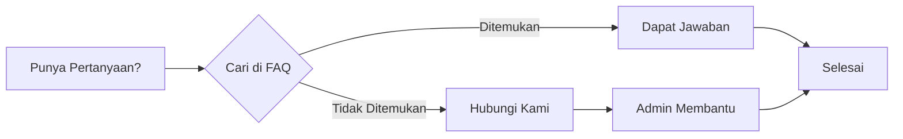

# FAQ - Pertanyaan yang Sering Diajukan

Temukan jawaban atas pertanyaan umum seputar pendaftaran MANSOSKUL.

## Akun & Login

<FaqAccordion :items="[
  {
    q: 'Bagaimana cara mendaftar akun di aplikasi?',
    a: 'Buka halaman lentera.puspenkomusu.com, klik tombol Daftar, isi form dengan data diri Anda. Anda juga bisa mendaftar menggunakan akun Google untuk proses yang lebih cepat.'
  },
  {
    q: 'Apakah saya bisa mendaftar tanpa email?',
    a: 'Tidak. Email diperlukan untuk verifikasi akun dan komunikasi selama proses pendaftaran.'
  },
  {
    q: 'Bagaimana cara login menggunakan Google?',
    a: 'Klik tombol Login dengan Google di halaman login, pilih akun Google yang sudah didaftarkan saat registrasi.'
  },
  {
    q: 'Saya daftar pakai Google, apakah perlu update password?',
    a: 'Ya, wajib. Pengguna yang mendaftar dengan Google harus update password di menu Profil Pengguna sebelum dapat mendaftar event.'
  },
  {
    q: 'Saya lupa password, bagaimana cara reset?',
    a: 'Klik Lupa Password di halaman login, masukkan email terdaftar, lalu ikuti link reset yang dikirim ke email Anda.'
  },
  {
    q: 'Apakah akun bisa digunakan untuk beberapa event?',
    a: 'Ya, satu akun bisa digunakan untuk mendaftar di beberapa event selama event tersebut masih dibuka.'
  },
  {
    q: 'Mengapa akun saya terkunci?',
    a: 'Akun terkunci setelah 5 kali gagal login. Tunggu 30 menit untuk mencoba lagi atau hubungi admin.'
  },
]" />

## Pendaftaran Event

<FaqAccordion :items="[
  {
    q: 'Bagaimana cara mendaftar event MANSOSKUL?',
    a: 'Login ke dashboard, ketik kode event MANSOSKUL yang dibagikan panitia di kolom pencarian, klik Daftar pada card yang muncul, lalu isi form biodata.'
  },
  {
    q: 'Bagaimana cara mendapatkan kode event MANSOSKUL?',
    a: 'Kode event dibagikan secara eksklusif oleh panitia. Jika belum memiliki kode, hubungi panitia.'
  },
  {
    q: 'Apa yang dimaksud dengan status Draft?',
    a: 'Status Draft berarti data pendaftaran Anda baru dibuat dan belum lengkap. Anda perlu melengkapi semua data dan tab yang diperlukan.'
  },
  {
    q: 'Apakah saya bisa membatalkan pendaftaran?',
    a: 'Pembatalan pendaftaran dapat dilakukan sebelum verifikasi admin. Hubungi admin untuk proses pembatalan.'
  },
]" />

## Form Biodata

<FaqAccordion :items="[
  {
    q: 'Form apa saja yang harus diisi?',
    a: 'Ada 5 tab yang harus diisi: Data Diri, Riwayat Pekerjaan, Pengalaman Organisasi, Kursus dan Pelatihan, dan Inventory (Lingkungan Kehidupan).'
  },
  {
    q: 'Apakah semua tab wajib diisi?',
    a: 'Ya, semua tab wajib diisi dan disimpan. Setiap tab memiliki tombol Simpan masing-masing.'
  },
  {
    q: 'Apakah data bisa diubah setelah disimpan?',
    a: 'Data yang sudah disimpan bisa diubah sendiri sebelum diverifikasi admin. Jika sudah diverifikasi, hubungi admin untuk perubahan.'
  },
  {
    q: 'Apakah saya harus upload sertifikat kursus?',
    a: 'Upload sertifikat bersifat opsional. Anda tetap bisa menyimpan data kursus tanpa upload file.'
  },
  {
    q: 'Berapa ukuran maksimal file yang bisa diupload?',
    a: 'Ukuran maksimal file adalah 1 MB dengan resolusi maksimal 2500 x 1600 piksel, format JPG.'
  },
  {
    q: 'Mengapa upload foto gagal terus?',
    a: 'Penyebab umum: file terlalu besar, format tidak sesuai, resolusi terlalu tinggi, atau koneksi internet tidak stabil.'
  },
]" />

## Teknis

<FaqAccordion :items="[
  {
    q: 'Aplikasi ini bisa diakses dari HP?',
    a: 'Ya, aplikasi dapat diakses dari smartphone, tablet, laptop, dan PC. Pastikan browser Anda dalam versi terbaru.'
  },
  {
    q: 'Browser apa yang disarankan?',
    a: 'Gunakan Google Chrome, Mozilla Firefox, atau Microsoft Edge versi terbaru untuk pengalaman terbaik.'
  },
  {
    q: 'Mengapa halaman tidak bisa dimuat?',
    a: 'Coba refresh halaman, clear cache browser, atau gunakan mode incognito/private. Periksa juga koneksi internet Anda.'
  },
  {
    q: 'Apakah data saya aman?',
    a: 'Ya, data Anda dilindungi dengan enkripsi. Aplikasi menggunakan protokol keamanan HTTPS untuk melindungi data pribadi.'
  },
  {
    q: 'Bagaimana cara logout dari aplikasi?',
    a: 'Klik ikon profil di pojok kanan atas, lalu pilih menu Logout atau Keluar.'
  },
  {
    q: 'Apa yang harus dilakukan jika ada error pada sistem?',
    a: 'Ambil screenshot error, catat pesan yang muncul, lalu laporkan ke admin melalui WhatsApp atau email.'
  },
]" />

## Lainnya

<FaqAccordion :items="[
  {
    q: 'Bagaimana cara menghubungi admin?',
    a: 'Hubungi admin melalui WhatsApp atau email yang tertera di halaman Hubungi Kami pada jam kerja (Senin-Jumat, 08.00-16.00 WIB).'
  },
  {
    q: 'Kapan pengumuman hasil seleksi?',
    a: 'Jadwal pengumuman akan diinformasikan melalui dashboard dan notifikasi. Pantau terus status pendaftaran Anda.'
  },
  {
    q: 'Siapa yang bisa saya hubungi untuk masalah teknis?',
    a: 'Hubungi admin teknis melalui WhatsApp atau email yang tertera di halaman Hubungi Kami.'
  },
]" />

---

Tidak menemukan jawaban? [Hubungi Kami](/hubungi-admin) untuk bantuan lebih lanjut.
