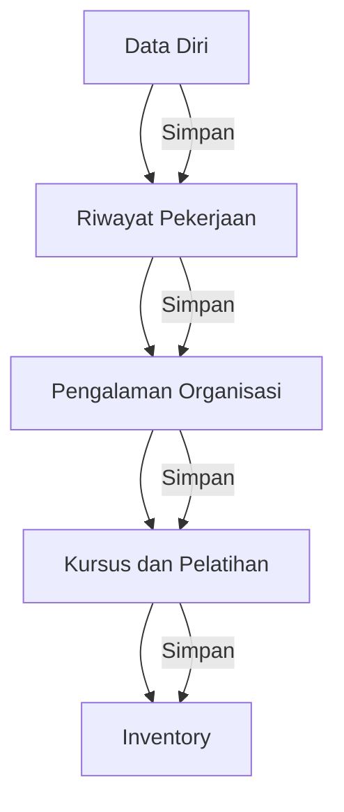

# Form Biodata

Form biodata adalah komponen utama dalam pendaftaran MANSOSKUL. Seluruh data yang Anda isi pada formulir ini akan digunakan sebagai bahan seleksi dan verifikasi oleh panitia.

 Penting

Setiap tab memiliki tombol <strong>Simpan</strong> masing-masing. Pastikan Anda menyimpan data sebelum berpindah ke tab lain. Data yang sudah tersimpan akan tetap ada meskipun Anda logout.

<TabGroup vertical titles="Data Diri,Riwayat Pekerjaan,Pengalaman Organisasi,Kursus dan Pelatihan,Inventory">

<template #tab-0>

## Tab 1: Data Diri

Tab ini berisi data pribadi Anda. Pastikan data yang diisi sesuai dengan dokumen resmi (KTP).

### Field Input

| Field | Tipe | Opsi / Contoh |
|-------|------|---------------|
| Nama Lengkap | Teks | Nama lengkap sesuai KTP |
| Jenis Kelamin | Pilihan | Laki-laki / Perempuan |
| Tempat Lahir | Teks | Kota kelahiran |
| Tanggal Lahir | Date | Format YYYY-MM-DD |
| Nomor Whatsapp | Teks | Nomor aktif, diawali 62 |
| Alamat | Textarea | Alamat lengkap sesuai KTP |
| Agama | Pilihan | Islam / Protestan / Katolik / Hindu / Budha |
| Pendidikan Terakhir | Teks | Pendidikan terakhir |
| Foto Terbaru | File (JPG) | Max 1 MB, 2500x1600 px |

</template>

<template #tab-1>

## Tab 2: Riwayat Pekerjaan

Tab ini berisi pengalaman kerja yang pernah Anda jalani.

### Field Tabel Dinamis

| Kolom | Tipe | Keterangan |
|-------|------|-----------|
| Nama Perusahaan / Instansi | Teks | Nama tempat bekerja |
| Posisi / Jabatan | Teks | Posisi atau jabatan terakhir |
| Tanggal Mulai | Date | Tanggal mulai bekerja |
| Tanggal Selesai | Date | Tanggal berakhir (kosongkan jika masih bekerja) |
| Deskripsi Pekerjaan | Textarea | Uraian tugas secara singkat |

Gunakan tombol **Tambah** untuk menambahkan baris baru dan tombol **Hapus** untuk menghapus.

</template>

<template #tab-2>

## Tab 3: Pengalaman Organisasi

Tab ini berisi aktivitas dan pengalaman organisasi yang pernah diikuti.

### Field Tabel Dinamis

| Kolom | Tipe | Keterangan |
|-------|------|-----------|
| Nama Organisasi | Teks | Nama organisasi |
| Posisi / Jabatan | Teks | Posisi dalam organisasi |
| Bidang Kegiatan | Teks | Bidang kegiatan organisasi |
| Tanggal Mulai | Date | Tanggal mulai bergabung |
| Tanggal Selesai | Date | Tanggal berakhir (kosongkan jika masih aktif) |
| Deskripsi | Textarea | Uraian pengalaman organisasi |

Gunakan tombol **Tambah** untuk menambahkan baris baru dan tombol **Hapus** untuk menghapus.

</template>

<template #tab-3>

## Tab 4: Kursus dan Pelatihan

Tab ini berisi kursus, pelatihan, atau workshop yang pernah diikuti.

### Field Tabel Dinamis

| Kolom | Tipe | Keterangan |
|-------|------|-----------|
| Nama Kursus / Pelatihan | Teks | Nama kegiatan |
| Penyelenggara | Teks | Institusi penyelenggara |
| Tahun | Teks | Tahun pelaksanaan |
| Sertifikat | File (JPG) | Upload sertifikat (jika ada) |

Gunakan tombol **Tambah** untuk menambahkan baris baru dan tombol **Hapus** untuk menghapus.

 Keterangan

Sertifikat tidak wajib diupload. Jika tidak memiliki sertifikat, Anda tetap bisa menyimpan data kursus/pelatihan tanpa upload file.

</template>

<template #tab-4>

## Tab 5: Lingkungan Kehidupan / Inventory

Tab ini berisi **inventori psikologis** tentang bagaimana tanggapan dan respons Anda terhadap berbagai situasi dan masalah dalam kehidupan. Isilah dengan jujur sesuai dengan pengalaman dan kepribadian Anda.

### Field Tabel Dinamis

| Kolom | Tipe | Keterangan |
|-------|------|-----------|
| Situasi / Masalah | Teks | Jelaskan situasi atau masalah yang pernah Anda hadapi |
| Tanggapan / Respons | Textarea (Summernote) | Uraikan bagaimana Anda menanggapi situasi tersebut |
| Tindakan yang Dilakukan | Textarea (Summernote) | Langkah-langkah yang Anda ambil dalam menghadapi masalah |
| Hasil / Dampak | Textarea (Summernote) | Hasil dari tindakan Anda dan dampaknya terhadap lingkungan |

Gunakan tombol **Tambah** untuk menambahkan baris baru dan tombol **Hapus** untuk menghapus. Setiap baris merepresentasikan satu situasi/masalah yang pernah Anda alami.

 Tips Pengisian

- Jelaskan situasi secara konkret dan detail
- Gunakan pengalaman nyata yang pernah Anda alami
- Tuliskan respons dan tindakan Anda dengan jujur
- Refleksikan hasil dan pembelajaran dari setiap situasi
- Gunakan editor Summernote untuk memformat jawaban dengan rapi

</template>

</TabGroup>

## Menyimpan Data

Setiap tab memiliki tombol **Simpan** di bagian bawah. Pastikan Anda menyimpan data setiap tab sebelum berpindah ke tab lain.

| Tombol | Fungsi |
|--------|--------|
| Simpan (Data Diri) | Menyimpan seluruh field Data Diri beserta foto |
| Simpan (Riwayat Pekerjaan) | Menyimpan data per baris pada tabel riwayat pekerjaan |
| Simpan (Pengalaman Organisasi) | Menyimpan data per baris pada tabel pengalaman organisasi |
| Simpan (Kursus dan Pelatihan) | Menyimpan data per baris pada tabel kursus |
| Simpan (Inventory) | Menyimpan data per baris pada tabel inventori psikologis |

## Hal yang Perlu Diperhatikan

 Perhatian

- Data yang sudah disimpan dan diverifikasi admin tidak dapat diubah sendiri oleh peserta. Hubungi admin jika terdapat kesalahan data.
- Isilah data dengan jujur dan sesuai dengan dokumen resmi. Ketidaksesuaian data dapat menyebabkan pembatalan keikutsertaan.
- Setiap tab wajib diisi. Pastikan tidak ada tab yang terlewat.

