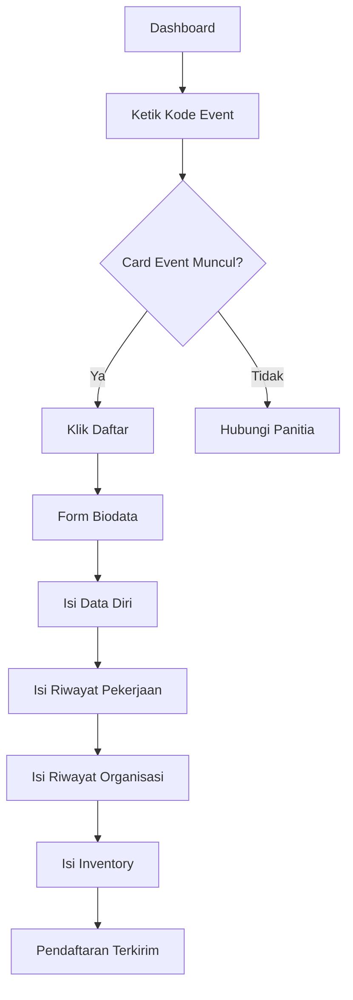

# Mendaftar Event

Setelah login, Anda dapat mendaftar ke event MANSOSKUL dengan mencari kode event yang dibagikan panitia melalui dashboard.

## Mencari Event

1. Login ke akun Anda
2. Pada dashboard, ketik **kode event MANSOSKUL** yang dibagikan oleh panitia di kolom pencarian

 Kode Event

Kode event MANSOSKUL hanya diketahui oleh peserta yang sudah mendapatkannya dari panitia. Jika belum memiliki kode, hubungi panitia terlebih dahulu.

## Card Event

Jika kode event cocok, akan muncul card dengan informasi berikut:

| Informasi | Keterangan |
|-----------|-----------|
| Nama Event | MANSOSKUL |
| Tanggal | Sesuai jadwal |
| Lokasi | Sesuai jadwal |
| Deskripsi | Informasi event |
| Tombol Daftar | Klik untuk mulai mendaftar |

## Mendaftar ke Event

1. Pada card event, klik tombol **"Daftar"**
2. Form Biodata akan muncul dengan 5 tab yang perlu diisi:

   - **Data Diri** — Data pribadi peserta
   - **Riwayat Pekerjaan** — Pengalaman kerja (jika ada)
   - **Pengalaman Organisasi** — Riwayat organisasi
   - **Kursus dan Pelatihan** — Pelatihan yang pernah diikuti
   - **Inventory** — Inventori psikologis respons terhadap masalah

3. Setiap tab memiliki tombol **"Simpan"** masing-masing
4. Pastikan semua tab sudah diisi dan disimpan

## Setelah Mendaftar

Setelah pendaftaran terkirim, status pendaftaran Anda akan muncul di dashboard dengan status awal **Draft**.

Langkah selanjutnya:

1. Lengkapi data yang masih kurang di [Form Biodata](/mansoskul/form-biodata)
2. Pantau [Status Pendaftaran](/mansoskul/status-pendaftaran)

## Hal yang Perlu Diperhatikan

 Perhatian

- Pastikan semua data sudah diisi dan disimpan sebelum logout
- Data yang sudah disimpan akan tetap ada meskipun Anda logout
- Hubungi admin jika ada kendala teknis

