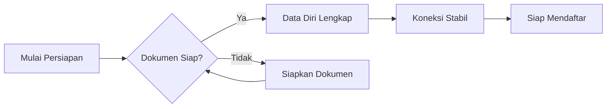

# Persiapan Pendaftaran

Sebelum memulai proses pendaftaran event MANSOSKUL, pastikan Anda telah menyiapkan semua dokumen dan data yang diperlukan. Persiapan yang baik akan memperlancar proses pendaftaran.

## Data Diri yang Harus Disiapkan

| Data | Keterangan |
|------|-----------|
| Nama Lengkap | Sesuai KTP |
| Tempat & Tanggal Lahir | Sesuai akta kelahiran |
| Jenis Kelamin | Laki-laki / Perempuan |
| Agama | Sesuai KTP |
| Alamat | Alamat lengkap |
| Nomor HP | Nomor aktif Whatsapp |
| Email | Email aktif |

## Dokumen yang Disarankan

| Dokumen | Format | Ukuran | Keterangan |
|---------|--------|--------|-----------|
| Foto Terbaru | JPG | 1 MB | 2500x1600px, latar merah |
| Sertifikat Kursus/Pelatihan | JPG | 1 MB | Scan jelas (jika ada) |
| Sertifikat Organisasi | JPG | 1 MB | Scan jelas (jika ada) |

## Data Riwayat yang Harus Disiapkan

| Riwayat | Data yang Perlu Disiapkan |
|---------|--------------------------|
| Pekerjaan | Nama perusahaan, posisi, masa kerja, deskripsi tugas |
| Organisasi | Nama organisasi, posisi, masa kegiatan, bidang |
| Kursus & Pelatihan | Nama kursus, penyelenggara, tahun, sertifikat |
| Inventory | Refleksi situasi/masalah, tanggapan, tindakan, dan hasil |

 Tips Mempersiapkan Data

- Catat semua pengalaman organisasi dan pekerjaan sebelumnya
- Siapkan contoh situasi/masalah nyata yang pernah dihadapi
- Pastikan file tidak rusak (corrupt) sebelum diupload
- Siapkan semua data sebelum mulai mengisi form

## Persyaratan Hardware & Software

### Perangkat yang Disarankan

| Perangkat | Spesifikasi Minimal |
|-----------|-------------------|
| Laptop / PC | RAM 4 GB, layar 1366x768 |
| Smartphone | Android 8 / iOS 13 ke atas |
| Browser | Chrome 90+, Firefox 90+, Edge 90+ |

### Koneksi Internet

 Perhatian

Koneksi internet yang stabil sangat diperlukan, terutama saat:
- Mengisi form biodata
- Upload dokumen pendukung

## Checklist Persiapan

Gunakan daftar berikut untuk memastikan semua sudah siap:

- [ ] Email aktif
- [ ] Nomor HP Whatsapp aktif
- [ ] Data diri lengkap (KTP)
- [ ] Data riwayat pekerjaan
- [ ] Data riwayat organisasi
- [ ] Data kursus dan pelatihan
- [ ] Refleksi situasi/masalah yang pernah dihadapi
- [ ] Foto terbaru (jika diperlukan)
- [ ] Koneksi internet stabil
- [ ] Browser terbaru

## Selanjutnya

Setelah semua persiapan selesai, lanjut ke [Registrasi Akun](/mansoskul/registrasi-akun).

<a href="https://lentera.puspenkomusu.com" target="_blank" class="cta-button" style="margin-top: 1rem;">
  <svg width="20" height="20" viewBox="0 0 24 24" fill="none" stroke="currentColor" stroke-width="2.5" stroke-linecap="round" stroke-linejoin="round"><path d="M18 13v6a2 2 0 0 1-2 2H5a2 2 0 0 1-2-2V8a2 2 0 0 1 2-2h6"/><polyline points="15 3 21 3 21 9"/><line x1="10" y1="14" x2="21" y2="3"/></svg>
  Buka Aplikasi Lentera
</a>
