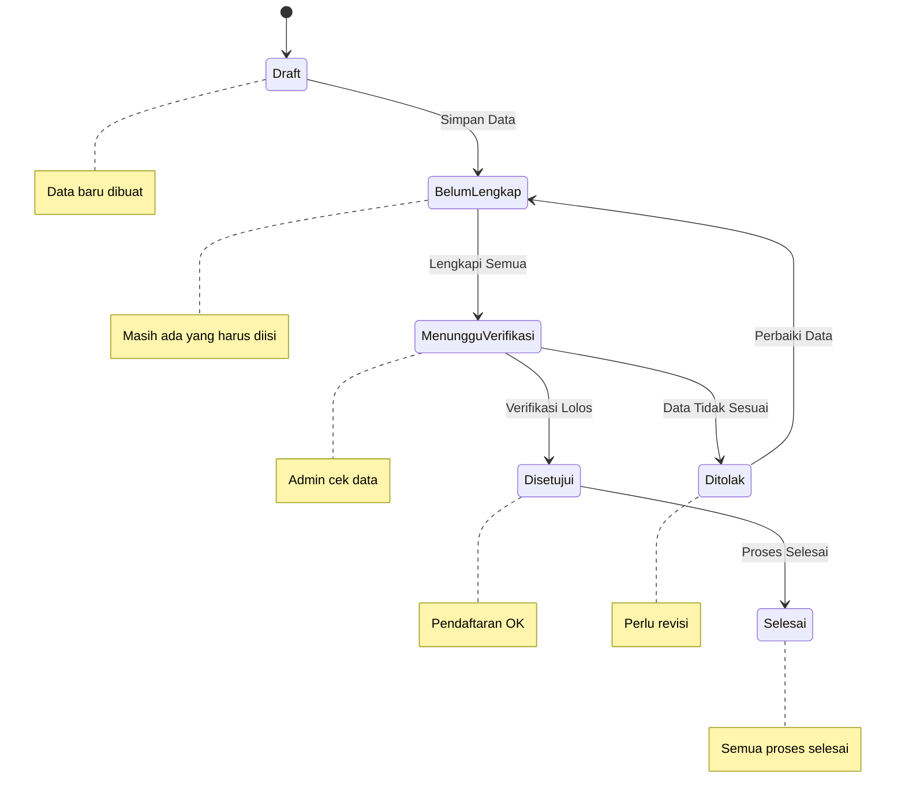

# Status Pendaftaran

Setelah mendaftar event MANSOSKUL, Anda dapat memantau status pendaftaran secara real-time melalui dashboard.

## Cara Melihat Status

1. Login ke akun Anda
2. Pada dashboard, lihat bagian **"Status Pendaftaran"**
3. Status akan ditampilkan dengan badge warna

## Arti Setiap Status

### <StatusBadge status="draft" />

Status **Draft** berarti pendaftaran Anda baru dibuat dan belum lengkap.

**Yang harus dilakukan:**
- Lengkapi seluruh data di form biodata
- Segera isi semua tab yang tersedia

### <StatusBadge status="belum-lengkap" />

Status **Belum Lengkap** berarti ada data yang masih kurang.

**Yang harus dilakukan:**
- Cek tab mana yang masih kosong
- Lengkapi data yang diminta

### <StatusBadge status="menunggu-verifikasi" />

Status **Menunggu Verifikasi** berarti semua data sedang diperiksa oleh admin.

**Yang harus dilakukan:**
- Tunggu proses verifikasi
- Periksa notifikasi secara berkala

### <StatusBadge status="disetujui" />

Status **Disetujui** berarti pendaftaran Anda telah diverifikasi dan diterima.

**Yang harus dilakukan:**
- Catat nomor registrasi Anda
- Tunggu pengumuman selanjutnya

### <StatusBadge status="ditolak" />

Status **Ditolak** berarti ada data yang tidak sesuai ketentuan.

**Yang harus dilakukan:**
- Baca catatan dari admin
- Perbaiki data yang ditolak
- Hubungi admin jika ada yang tidak jelas

### <StatusBadge status="selesai" />

Status **Selesai** berarti seluruh proses pendaftaran telah selesai.

**Yang harus dilakukan:**
- Tunggu pengumuman hasil seleksi
- Persiapkan diri untuk tahap selanjutnya

## Notifikasi Status

Anda akan mendapatkan notifikasi ketika:

- Status pendaftaran berubah
- Data ditolak dan perlu diperbaiki

::: tip
- Periksa status secara rutin
- Baca notifikasi dengan teliti
- Jika status tidak berubah dalam 3 hari, hubungi admin
- Catat nomor registrasi untuk referensi
:::

## Selanjutnya

Jika ada pertanyaan tentang status pendaftaran, cek [FAQ](/mansoskul/faq) atau [Hubungi Kami](/hubungi-admin).
