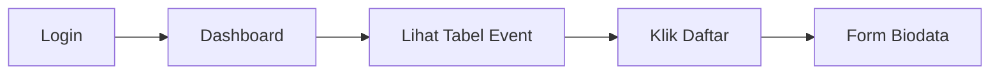

# Dashboard Peserta

Dashboard adalah halaman utama yang Anda lihat setelah login. Dari sini Anda dapat melihat event yang tersedia dan mendaftar.

## Tampilan Dashboard

Setelah login, Anda akan langsung melihat halaman dashboard yang menampilkan tabel daftar event PPDGS yang sedang berlangsung. Setiap baris event dilengkapi dengan tombol **"Daftar"** untuk memulai pendaftaran.

## Informasi di Dashboard

Notifikasi

Update terbaru tentang pendaftaran Anda akan muncul di bagian atas dashboard. Periksa secara berkala.

Status

Setiap perubahan status pendaftaran akan langsung terlihat di dashboard.

## Status Pendaftaran

| Status | Keterangan |
|--------|-----------|
| Draft | Pendaftaran belum lengkap |
| Menunggu Pembayaran | Belum melakukan pembayaran |
| Menunggu Verifikasi | Dokumen sedang diperiksa |
| Disetujui | Pendaftaran diterima |
| Ditolak | Ada dokumen yang perlu diperbaiki |
| Selesai | Semua proses selesai |

## Langkah Selanjutnya

Dari dashboard Anda dapat:

- [Mendaftar event](/ppdgs/mendaftar-event) dengan mengklik tombol **"Daftar"** pada event yang tersedia
- [Melengkapi biodata](/ppdgs/form-biodata)
- [Melakukan pembayaran](/ppdgs/pembayaran)

Tips

- Periksa dashboard setiap hari untuk melihat update terbaru
- Segera lengkapi data yang diminta
- Hubungi admin jika ada status yang tidak berubah dalam 3 hari

