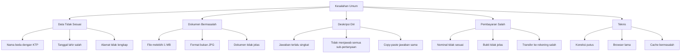

# Kesalahan yang Sering Dilakukan Peserta

Pelajari dari kesalahan umum peserta lain agar pendaftaran Anda berjalan lancar.

## Kesalahan Data Diri

### 1. Nama Tidak Sesuai KTP

**Masalah:** Menggunakan nama panggilan atau gelar saat mengisi nama.

**Solusi:** Gunakan nama lengkap sesuai KTP tanpa gelar akademik.

### 2. Tanggal Lahir Salah

**Masalah:** Format tanggal lahir terbalik (bulan-tanggal-tahun).

**Solusi:** Gunakan format DD/MM/YYYY sesuai petunjuk.

### 3. Alamat Tidak Lengkap

**Masalah:** Alamat ditulis singkat, tanpa RT/RW atau kode pos.

**Solusi:** Tulis alamat lengkap sesuai KTP.

## Kesalahan Dokumen

### 4. File Melebihi 1 MB

**Masalah:** Ukuran file melebihi batas maksimal 1 MB.

**Solusi:**

| Jenis Dokumen | Solusi |
|--------------|--------|
| Foto | Kompres dengan aplikasi image compressor |
| Scan Ijazah | Scan 300 DPI, kompres ke JPG |
| Sertifikat | Gunakan screenshot atau scan dengan resolusi rendah |

### 5. Format File Bukan JPG

**Masalah:** Mengupload file dengan format yang tidak didukung (HEIC, BMP, PNG untuk dokumen wajib, DOCX, PDF).

**Solusi:**
- Semua dokumen wajib harus dalam format **JPG**
- Hanya Bukti Pembayaran yang bisa menggunakan **PNG**
- Gunakan converter online gratis jika perlu

### 6. Dokumen Tidak Jelas

**Masalah:** Scan dokumen buram, terpotong, atau terlalu kecil.

**Solusi:**
- Scan dengan resolusi 300 DPI
- Pastikan seluruh dokumen terlihat dalam frame
- Gunakan latar putih polos
- Cahaya cukup saat memotret

### 7. Resolusi Melebihi 2500 x 1600 px

**Masalah:** Gambar beresolusi terlalu tinggi sehingga gagal diupload.

**Solusi:** Resize gambar ke resolusi maksimal 2500 x 1600 piksel sebelum upload.

### 8. Dokumen Belum Dilegalisir

**Masalah:** Ijazah yang diupload belum dilegalisir (hanya fotokopi).

**Solusi:** Legalisir ijazah S1 dan ijazah profesi dokter di institusi pendidikan asal.

## Kesalahan Deskripsi Diri

### 9. Jawaban Terlalu Singkat

**Masalah:** Setiap pertanyaan deskripsi diri membutuhkan jawaban yang cukup mendetail, namun peserta hanya menulis 1-2 kalimat.

**Solusi:** Tulis jawaban minimal 3-5 paragraf yang menjelaskan pengalaman, motivasi, dan relevansi dengan program studi yang dituju.

### 10. Tidak Menjawab Semua Sub-Pertanyaan

**Masalah:** Setiap pertanyaan deskripsi diri memiliki beberapa sub-poin yang harus dijawab. Peserta sering melewatkan beberapa sub-poin.

**Solusi:** Baca pertanyaan dengan saksama dan pastikan setiap sub-poin terjawab dalam tulisan Anda.

### 11. Copy-Paste Jawaban yang Sama

**Masalah:** Menggunakan jawaban yang persis sama untuk pertanyaan yang berbeda.

**Solusi:** Setiap pertanyaan memiliki konteks berbeda. Sesuaikan jawaban untuk masing-masing pertanyaan secara spesifik.

### 12. Tidak Memeriksa Ejaan

**Masalah:** Terdapat banyak typo dan kesalahan penulisan dalam jawaban deskripsi diri.

**Solusi:** Gunakan fitur spell check atau baca ulang jawaban sebelum menyimpan.

## Kesalahan Pembayaran

### 13. Nominal Transfer Tidak Sesuai

**Masalah:** Mentransfer dengan nominal kurang atau lebih.

**Solusi:** Transfer sesuai nominal tagihan **persis** (termasuk koma jika ada).

### 14. Bukti Transfer Tidak Jelas

**Masalah:** Foto bukti transfer buram, terpotong, atau tidak terbaca.

**Solusi:**
- Pastikan nominal, tanggal, dan nama terlihat jelas
- Gunakan screenshot dari aplikasi banking
- Jangan crop bagian informasi penting

### 15. Transfer ke Rekening Salah

**Masalah:** Transfer ke rekening yang tidak terdaftar.

**Solusi:** Periksa 3 kali nomor rekening sebelum transfer.

## Kesalahan Teknis

### 16. Koneksi Internet Putus Saat Upload

**Solusi:**
- Gunakan koneksi kabel (LAN) jika memungkinkan
- Upload file satu per satu di setiap tab
- Hindari upload di jam sibuk

### 17. Browser Tidak Update

**Solusi:** Gunakan browser versi terbaru (Chrome/Firefox/Edge).

### 18. Cache Bermasalah

**Solusi:** Clear cache browser atau gunakan mode incognito.

## Daftar Periksa Sebelum Submit

Sebelum mengirim pendaftaran, periksa hal berikut:

- [ ] Nama sesuai KTP
- [ ] Tanggal lahir benar
- [ ] Nomor HP aktif
- [ ] Email benar
- [ ] Semua field terisi di setiap tab
- [ ] Semua pertanyaan deskripsi diri dijawab lengkap
- [ ] Dokumen format JPG
- [ ] Ukuran file di bawah 1 MB
- [ ] Resolusi maksimal 2500 x 1600 px
- [ ] Dokumen terbaca jelas
- [ ] Ijazah sudah dilegalisir
- [ ] Transfer nominal tepat
- [ ] Bukti transfer jelas
