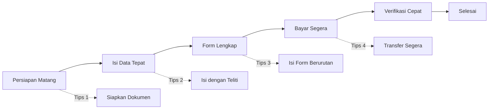

# Tips Agar Pendaftaran Cepat Selesai

Ingin proses pendaftaran PPDGS berjalan lancar dan cepat? Ikuti tips-tips berikut.

## 1. Siapkan Semua Dokumen Sebelum Mendaftar

Ini adalah tips paling penting! Jangan mulai mendaftar jika dokumen belum siap.

**Lakukan sebelum mulai:**
- [x] Siapkan foto terbaru (formal, latar merah)
- [x] Scan ijazah S1 dan ijazah profesi (legalisir basah)
- [x] Siapkan sertifikat non formal, prestasi, dan karya tulis
- [x] Konversi semua dokumen ke format JPG
- [x] Pastikan ukuran file di bawah 1 MB dan resolusi maksimal 2500 x 1600 px
- [x] Simpan di folder khusus di komputer/HP

## 2. Gunakan Laptop atau PC

Meskipun bisa menggunakan HP, proses pengisian form dan upload dokumen akan lebih mudah di laptop atau PC.

**Keuntungan menggunakan laptop:**
- Layar lebih besar untuk melihat form bertab
- Keyboard lebih nyaman untuk mengetik deskripsi diri
- Koneksi internet lebih stabil (LAN)
- Mempermudah manajemen file

## 3. Siapkan Koneksi Internet yang Stabil

| Aktivitas | Kecepatan Minimal | Saran |
|-----------|------------------|-------|
| Isi form | 1 Mbps | Cukup |
| Upload dokumen (via tab) | 5 Mbps | Gunakan WiFi |
| Upload banyak tab | 10 Mbps | Hindari jam sibuk |

## 4. Isi Data dengan Teliti

Kesalahan data dapat memperlambat proses verifikasi. Isi data dengan cermat!

**Perhatikan:**
- Nama sesuai KTP (tanpa gelar)
- Tanggal lahir format DD/MM/YYYY
- Nomor HP diawali 62
- Alamat lengkap
- Isi semua field yang bertanda wajib di setiap tab

## 5. Siapkan Jawaban Deskripsi Diri

Terdapat 16 pertanyaan Deskripsi Diri yang harus diisi menggunakan **Summernote** (rich text editor). Persiapkan jawaban terlebih dahulu agar tidak perlu mengetik panjang saat mengisi formulir.

**Tips mengisi Deskripsi Diri:**
- Siapkan draf jawaban di Word/Google Docs sebelum mendaftar
- Jawab setiap sub-pertanyaan secara lengkap
- Gunakan format paragraf yang rapi (maksimal 5000 karakter per pertanyaan)
- Jangan copy-paste jawaban yang sama untuk pertanyaan berbeda
- Periksa ejaan sebelum menyimpan

## 6. Isi Form Secara Berurutan

Isi setiap tab dari kiri ke kanan secara berurutan. Upload dokumen langsung saat berada di tab yang sesuai. Jangan melompat-lompat agar tidak ada field yang terlewat.

## 7. Lakukan Pembayaran Segera

Setelah semua tab terisi lengkap, segera lakukan pembayaran dan upload bukti pembayaran di menu Pembayaran. Jangan menunggu mendekati batas waktu.

## 8. Pantau Status Secara Rutin

Periksa dashboard setiap hari untuk:
- Memastikan tidak ada dokumen yang ditolak
- Melihat update status terbaru
- Merespon cepat jika ada permintaan revisi

## 9. Catat Nomor Registrasi

Segera setelah mendaftar, catat nomor registrasi Anda. Nomor ini akan diperlukan untuk:
- Komunikasi dengan admin
- Pembayaran
- Melacak status pendaftaran

## Timeline Ideal

| Hari | Aktivitas | Durasi |
|------|-----------|--------|
| Hari 1 | Siapkan dokumen dan draf jawaban deskripsi diri | 2-3 jam |
| Hari 2 | Registrasi akun & isi biodata | 30 menit |
| Hari 2 | Isi tab Pendidikan Kedokteran (ijazah + deskripsi) | 30 menit |
| Hari 2 | Isi tab Pendidikan Non Formal | 15 menit |
| Hari 2 | Isi tab Karya Tulis | 15 menit |
| Hari 2 | Isi tab Prestasi dan Penghargaan | 15 menit |
| Hari 2 | Upload bukti pembayaran | 15 menit |
| Hari 3-5 | Verifikasi admin | 1-3 hari |
| Hari 5+ | Selesai | - |
