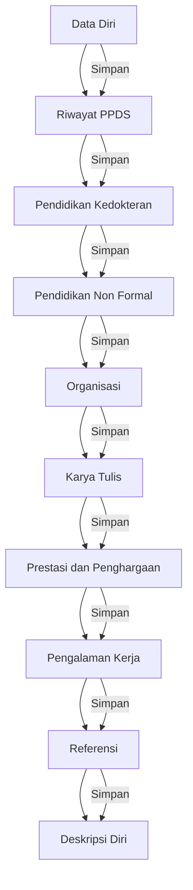

# Form Biodata

Form biodata adalah komponen utama dalam pendaftaran PPDGS. Seluruh data yang Anda isi pada formulir ini akan digunakan sebagai bahan seleksi dan verifikasi oleh panitia.

 Penting

Setiap tab memiliki tombol <strong>Simpan</strong> masing-masing. Pastikan Anda menyimpan data sebelum berpindah ke tab lain. Data yang sudah tersimpan akan tetap ada meskipun Anda logout.

## Spesifikasi Upload File

Semua file yang diunggah melalui formulir ini memiliki ketentuan yang sama:

| Item | Ketentuan |
|------|-----------|
| Format | JPG (.jpg) |
| Ukuran Maksimal | 1 MB |
| Resolusi Maksimal | 2500 x 1600 piksel |

<TabGroup vertical titles="Data Diri,Riwayat PPDGS,Pendidikan Kedokteran,Pendidikan Non Formal,Organisasi,Karya Tulis,Prestasi dan Penghargaan,Pengalaman Kerja,Referensi,Deskripsi Diri">

<template #tab-0>

## Tab 1: Data Diri

Tab ini berisi data pribadi Anda. Pastikan data yang diisi sesuai dengan dokumen resmi (KTP, ijazah, dan akta lahir).

### Field Input

| Field | Tipe | Opsi / Contoh |
|-------|------|---------------|
| Nama | Teks | Nama lengkap sesuai KTP |
| Jenis Kelamin | Pilihan | Laki-laki / Perempuan |
| Tempat Lahir | Teks | Kota kelahiran |
| Tgl. Lahir | Date | Format YYYY-MM-DD |
| Nomor Whatsapp | Teks | Nomor aktif, diawali 62 |
| Alamat Rumah | Textarea | Alamat lengkap |
| Agama | Pilihan | Islam / Protestan / Katolik / Hindu / Budha |
| Suku Bangsa | Teks | Suku asal |
| Pendidikan Terakhir | Pilihan | S1 / S2 / S3 |
| Universitas | Teks | Nama universitas asal |
| Status Perkawinan | Pilihan | Belum Kawin / Kawin / Cerai Hidup / Cerai Mati |
| Program Dokter Spesialis yang dipilih | Teks | Nama program spesialis yang dituju |
| Alasan | Textarea | Alasan memilih program tersebut |
| Foto Terbaru | File (JPG) | Max 1 MB, 2500x1600 px |

### Persetujuan

Terdapat 2 pernyataan yang harus dijawab dengan pilihan **Ya** atau **Tidak**:

1. **Validasi Data** -- "Saya bersedia menjamin bahwa semua yang saya tulis di Formulir Data Diri beserta dokumen pendukung ini adalah benar. Saya memahami bahwa adanya informasi yang tidak benar didalam formulir ataupun dokumen pendukungnya, merupakan bukti yang memadai untuk pembatalan keikutsertaan dalam kegiatan psikotes."
2. **Izin Data** -- "Saya mengizinkan data-data yang saya berikan dalam tes psikologi ini digunakan lebih lanjut untuk keperluan penelitian."

</template>

<template #tab-1>

## Tab 2: Riwayat PPDGS

Tab ini menanyakan riwayat keikutsertaan Anda dalam seleksi PPDGS sebelumnya.

### Field

| Field | Tipe | Opsi |
|-------|------|------|
| Pernah mengikuti seleksi PPDGS? | Pilihan | Pernah / Tidak Pernah |

Jika menjawab **Pernah**, isi tabel dinamis berikut:

| Kolom | Tipe | Keterangan |
|-------|------|-----------|
| Program Spesialis | Teks | Nama program spesialis yang pernah diikuti |
| Perguruan Tinggi | Teks | Nama institusi penyelenggara |
| Bulan | Angka (1-12) | Bulan pendaftaran |
| Tahun | Angka (1990-2020) | Tahun pendaftaran |

Gunakan tombol **Tambah** untuk menambahkan baris baru dan tombol **Hapus** untuk menghapus.

</template>

<template #tab-2>

## Tab 3: Pendidikan Kedokteran

Tab ini berisi riwayat pendidikan kedokteran formal yang sudah ditempuh.

### Field Tabel Dinamis

| Kolom | Tipe | Keterangan |
|-------|------|-----------|
| Jenjang | Pilihan | S1 Dokter / Profesi Dokter |
| Masuk | Angka | Tahun masuk |
| Keluar | Angka | Tahun keluar |
| Perguruan Tinggi | Teks | Nama universitas |
| IPK | Teks | Gunakan titik sebagai pemisah (contoh: 3.75) |
| Upload (Ijazah) | File (JPG) | Max 1 MB, 2500x1600 px |

 Keterangan

Upload Ijazah S1 Kedokteran dan Ijazah Profesi Dokter. File harus berformat .jpg dengan ukuran tidak lebih dari 1 MB dan resolusi maksimum 2500x1600 piksel.

</template>

<template #tab-3>

## Tab 4: Pendidikan Non Formal

Tab ini berisi kursus, pelatihan, atau workshop yang pernah diikuti (sertakan upload sertifikat atau lisensi).

### Field Tabel Dinamis

| Kolom | Tipe | Keterangan |
|-------|------|-----------|
| Kursus/Pelatihan/Workshop | Teks | Nama kegiatan |
| Penyelenggara | Teks | Institusi penyelenggara |
| Kota | Teks | Lokasi pelaksanaan |
| Waktu Pelaksanaan | Date | Tanggal pelaksanaan |
| Sertifikat/Lisensi | File (JPG) | Max 1 MB, 2500x1600 px |

 Catatan

Tidak termasuk segala bentuk kegiatan Seminar, Simposium, dan Pertemuan Ilmiah.

</template>

<template #tab-4>

## Tab 5: Organisasi

Tab ini berisi aktivitas dan pengalaman organisasi sejak perguruan tinggi sampai saat ini.

### Field Tabel Dinamis

| Kolom | Tipe | Keterangan |
|-------|------|-----------|
| Nama Organisasi | Teks | Nama organisasi |
| Bidang | Teks | Bidang kegiatan organisasi |
| Jabatan | Teks | Posisi dalam organisasi |
| Tingkat | Pilihan | Lokal / Regional / Nasional / Internasional |
| Masa Kegiatan (Tahun) | Angka (0-99) | Jumlah tahun |
| Masa Kegiatan (Bulan) | Angka (0-11) | Jumlah bulan |

</template>

<template #tab-5>

## Tab 6: Karya Tulis

Tab ini berisi hasil karya tulis atau publikasi seperti artikel, buku, jurnal, dan lain-lain. Upload bukti cover dan halaman pertama.

### Field Tabel Dinamis

| Kolom | Tipe | Keterangan |
|-------|------|-----------|
| Judul | Teks | Judul karya tulis |
| Penerbit | Teks | Nama penerbit atau jurnal |
| Upload Cover | File (JPG) | Max 1 MB, 2500x1600 px |
| Upload Hal. Pertama | File (JPG) | Max 1 MB, 2500x1600 px |

</template>

<template #tab-6>

## Tab 7: Prestasi dan Penghargaan

Sebutkan prestasi dan penghargaan yang pernah Anda peroleh sejak perguruan tinggi sampai saat ini. Unggah bukti pendukung.

### Field Tabel Dinamis

| Kolom | Tipe | Keterangan |
|-------|------|-----------|
| Bidang/Kegiatan | Teks | Nama kegiatan atau bidang prestasi |
| Sifat Kegiatan | Pilihan | Lokal / Regional / Nasional / Internasional |
| Tahun | Teks | Tahun perolehan |
| Capaian | Teks | Capaian prestasi yang diraih |
| Upload Sertifikat | File (JPG) | Max 1 MB, 2500x1600 px |

</template>

<template #tab-7>

## Tab 8: Pengalaman Kerja

Sebutkan pengalaman kerja yang pernah Anda jalani.

### Field Tabel Dinamis

| Kolom | Tipe | Keterangan |
|-------|------|-----------|
| Nama Instansi | Teks | Nama perusahaan atau institusi |
| Penugasan/Jabatan | Teks | Posisi atau jabatan |
| Uraian Tugas | Textarea | Deskripsi tugas secara singkat |
| Masa Kerja (Masuk) | Date | Tanggal mulai bekerja |
| Masa Kerja (Keluar) | Date | Tanggal berakhir (kosongkan jika masih bekerja) |

</template>

<template #tab-8>

## Tab 9: Referensi

Sebutkan referensi yang dapat dihubungi.

### Field Tabel Dinamis

| Kolom | Tipe | Keterangan |
|-------|------|-----------|
| Nama | Teks | Nama lengkap referensi |
| Hubungan | Teks | Hubungan dengan Anda |
| Alamat | Teks | Alamat referensi |
| No. HP | Teks | Nomor telepon yang dapat dihubungi |

</template>

<template #tab-9>

## Tab 10: Deskripsi Diri

Jelaskan tentang diri Anda melalui 16 pertanyaan esai berikut. Setiap pertanyaan disediakan area teks (menggunakan editor summernote) untuk menjawab.

### Daftar Pertanyaan

**1. Bagaimana Anda mencari solusi ketika dituntut untuk menyelesaikan masalah secara cepat dan tepat.**
- a. Jelaskan masalah yang Anda hadapi
- b. Bagaimana langkah-langkah solusi dalam mengatasi masalah tersebut

**2. Bagaimana Anda mencari solusi ketika dihadapkan pada situasi dilematis.**
- a. Jelaskan dilema yang Anda hadapi
- b. Bagaimana langkah-langkah solusi dalam mengatasi dilema tersebut

**3. Pernahkan Anda mengambil tindakan melebihi apa yang diharapkan orang lain dalam menyelesaikan suatu pekerjaan.**
- a. Jika pernah, jelaskan situasinya!
- b. Apa yang Anda lakukan dalam situasi tersebut!

**4. Ceritakan kendala/kesulitan yang dihadapi selama menyelesaikan pendidikan di Perguruan Tinggi.**
- a. Apa kendala/kesulitan yang dihadapi?
- b. Bagaimana cara Anda mengatasinya!

**5. Ceritakan pengalaman Anda ketika sedang menyelesaikan tugas kuliah/pekerjaan yang di nilai sulit.**
- a. Jelaskan situasinya!
- b. Apa yang Anda lakukan dalam situasi tersebut?
- c. Bagaimana dampaknya terhadap kinerja Anda?

**6. Ceritakan situasi atau pengalaman yang dinilai paling berat atau terburuk yang pernah dialami dalam hidup Anda.**
- a. Jelaskan situasinya!
- b. Apa yang Anda lakukan dalam situasi tersebut?
- c. Bagaimana dampaknya terhadap kinerja Anda?

**7. Ceritakan pengalaman Anda terkait dengan belajar / bekerja dalam situasi yang tidak nyaman dan menekan!**
- a. Jelaskan situasinya!
- b. Apa yang Anda lakukan dalam situasi tersebut?
- c. Bagaimana dampaknya terhadap kinerja Anda?

**8. Ceritakan apa yang Anda lakukan dalam menyelesaikan tugas-tugas yang sukar dalam proses belajar atau di pekerjaan!**
- a. Jelaskan tugas yang sukar tersebut!
- b. Apa yang Anda lakukan!

**9. Ceritakan pengalaman Anda saat berada dalam situasi tertentu yang melibatkan banyak orang dengan berbagai karakter!**
- a. Jelaskan situasinya!
- b. Apa yang Anda lakukan!

**10. Ceritakan kebiasaan Anda ketika berada dalam suatu kelompok kerja yang sedang menghadapi tenggat waktu penyelesaian tugas.**
- (satu field jawaban)

**11. Ada kalanya, dalam hidup seseorang menghadapi suatu situasi yang tidak diharapkan.**
- a. Jelaskan pengalaman terkait dengan situasi yang tidak Anda harapkan
- b. Apa yang Anda rasakan dan bagaimana mengatasinya

**12. Ceritakan bagaimana cara Anda menghadapi suatu situasi yang mengharuskan untuk bertindak sesuai dengan tuntutan lingkungan, sementara Anda sedang memiliki suatu masalah.**
- a. Jelaskan tuntutan lingkungan dan masalah yang Anda hadapi
- b. Apa yang Anda rasakan dan lakukan

**13. Ceritakan pengalaman Anda ketika berhadapan dalam suatu masalah yang menuntut Anda untuk berpikir dan merasakan apa yang dialami orang lain.**
- a. Apa masalah yang Anda hadapi?
- b. Tindakan apa yang Anda lakukan?

**14. Pernahkan Anda dihadapkan dalam situasi banyaknya tugas yang harus diselesaikan, dan pada saat bersamaan ada orang lain yang membutuhkan keterlibatan Anda.**
- a. Jika pernah, jelaskan situasi yang Anda hadapi tersebut!
- b. Apa yang Anda lakukan!

**15. Sebutkan 5 sifat positif yang ada pada diri Anda!**
- (5 field input teks: 1 s.d. 5)

**16. Sebutkan 5 sifat negatif yang ada pada diri Anda!**
- (5 field input teks: 1 s.d. 5)

</template>

</TabGroup>

## Menyimpan Data

Setiap tab memiliki tombol **Simpan** di bagian bawah. Pastikan Anda menyimpan data setiap tab sebelum berpindah ke tab lain.

| Tombol | Fungsi |
|--------|--------|
| Simpan (Data Diri) | Menyimpan seluruh field Data Diri beserta foto |
| Simpan (setiap tabel dinamis) | Menyimpan data per baris pada tabel dinamis masing-masing tab |
| Simpan (Deskripsi Diri) | Menyimpan seluruh jawaban esai |

## Hal yang Perlu Diperhatikan

 Perhatian

- Data yang sudah disimpan dan diverifikasi admin tidak dapat diubah sendiri oleh peserta. Hubungi admin jika terdapat kesalahan data.
- Isilah data dengan jujur dan sesuai dengan dokumen resmi. Ketidaksesuaian data dapat menyebabkan pembatalan keikutsertaan.
- Pastikan semua file yang diunggah memenuhi spesifikasi format, ukuran, dan resolusi yang ditentukan.

