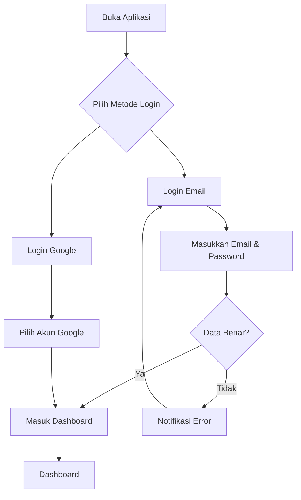

# Login

Setelah berhasil registrasi, Anda bisa login ke aplikasi untuk mengakses dashboard dan mendaftar event.

Halaman login dan registrasi berada pada halaman yang sama. Anda bisa beralih antara tab **"Masuk"** untuk login dan **"Daftar"** untuk registrasi.

## Login Menggunakan Email

1. Buka halaman [https://lentera.puspenkomusu.com/](https://lentera.puspenkomusu.com/)
2. Pada tab **"Masuk"**, masukkan email dan password yang sudah didaftarkan

   | Field | Contoh Pengisian |
   |-------|-----------------|
   | Email | andi.pratama@gmail.com |
   | Password | ******** |

3. Klik tombol **"Masuk"**
4. Anda akan diarahkan ke halaman Dashboard

## Login Menggunakan Google

1. Buka halaman [https://lentera.puspenkomusu.com/](https://lentera.puspenkomusu.com/)
2. Klik tombol **"Login dengan Google"**
3. Pilih akun Google yang sudah didaftarkan
4. Anda langsung masuk ke Dashboard

Tips

Pastikan Anda menggunakan akun Google yang **sama** saat registrasi dan login.

## Lupa Password

Jika Anda lupa password, ikuti langkah berikut:

1. Pada halaman login, klik **"Lupa Password"**
2. Masukkan alamat email yang terdaftar
3. Klik **"Kirim Link Reset"**
4. Buka email Anda
5. Klik link reset password yang dikirim
6. Masukkan password baru (2 kali)
7. Klik **"Simpan"**
8. Login dengan password baru

## Ganti Password

Untuk mengganti password:

1. Login ke akun Anda
2. Masuk ke menu **Profil** atau **Pengaturan Akun**
3. Klik tab **"Keamanan"** atau **"Ganti Password"**
4. Masukkan:

   | Field | Keterangan |
   |-------|-----------|
   | Password Lama | Password saat ini |
   | Password Baru | Password baru yang akan digunakan |
   | Konfirmasi Password Baru | Ketik ulang password baru |

5. Klik **"Simpan"**
6. Password berhasil diganti

Perhatian

Setelah mengganti password, Anda akan logout dari semua perangkat. Silakan login kembali dengan password baru.

## Troubleshooting Login

| Masalah | Penyebab | Solusi |
|---------|----------|--------|
| Email tidak terdaftar | Belum registrasi | Lakukan [registrasi](/ppdgs/registrasi-akun) |
| Password salah | Salah ketik | Periksa Caps Lock, reset password |
| Akun terkunci | 5x salah password | Tunggu 30 menit atau hubungi admin |
| Tidak bisa login Google | Akun Google berbeda | Gunakan akun Google saat registrasi |
| Halaman tidak loading | Koneksi internet | Refresh halaman, cek koneksi |
| Browser error | Cache bermasalah | Clear cache, gunakan mode incognito |
