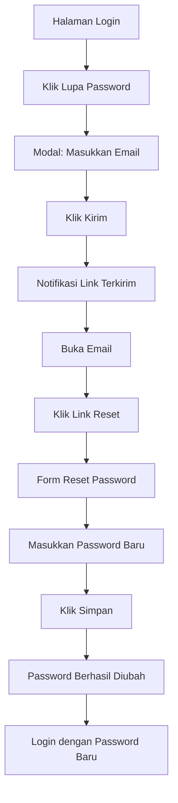

# Lupa Password

Jika Anda lupa password akun, ikuti panduan berikut untuk mereset password melalui email.

## Langkah-Langkah

### 1. Buka Halaman Login

Buka aplikasi di [https://lentera.puspenkomusu.com/](https://lentera.puspenkomusu.com/) dan pastikan Anda berada di tab **"Masuk"**.

### 2. Klik "Lupa Password"

Di bagian bawah form login, klik link **"Lupa Password"** untuk membuka modal reset password.

### 3. Masukkan Email

Pada modal yang muncul, masukkan alamat **email** yang terdaftar di akun Anda, lalu klik tombol **"Kirim"**.

| Field | Contoh Pengisian |
|-------|-----------------|
| Email | andi.pratama@gmail.com |

### 4. Notifikasi Link Terkirim

Setelah berhasil, akan muncul notifikasi bahwa link reset password telah dikirim ke email Anda.

### 5. Cek Email

Buka kotak masuk email Anda. Cari pesan dari sistem dengan subjek **Reset Password** atau **Link Reset Password**.

### 6. Buka Link Reset

Klik tombol atau link **"Reset Password"** yang ada di dalam email. Anda akan diarahkan ke halaman reset password.

### 7. Masukkan Password Baru

Pada halaman reset password, masukkan:

| Field | Keterangan |
|-------|-----------|
| Password Baru | Password baru yang akan digunakan |
| Konfirmasi Password Baru | Ketik ulang password baru |

Klik tombol **"Simpan"** atau **"Reset Password"**.

### 8. Login dengan Password Baru

Password berhasil direset. Kembali ke halaman login dan masuk menggunakan **email** dan **password baru** Anda.

Berhasil

Setelah password direset, Anda bisa langsung login dengan password baru tanpa verifikasi tambahan.

## Yang Perlu Diperhatikan

| Hal | Keterangan |
|----|-----------|
| Waktu kadaluarsa link | Link reset hanya berlaku **1 jam** setelah dikirim |
| Email tidak masuk? | Periksa folder **Spam** atau **Promosi** |
| Email salah? | Hubungi admin untuk bantuan perubahan email |
| Password sama | Tidak bisa menggunakan password yang sama dengan sebelumnya |
