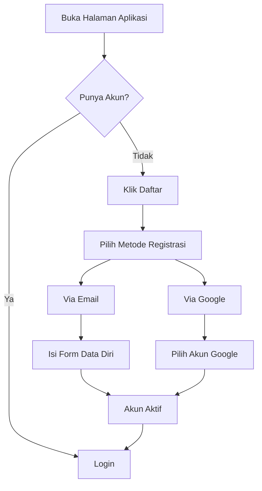

# Registrasi Akun

Sebelum dapat mendaftar event PPDGS, Anda harus memiliki akun terlebih dahulu. Ikuti langkah-langkah berikut untuk membuat akun.

## Kapan Harus Registrasi?

Registrasi akun dilakukan **sebelum** mendaftar event. Anda hanya perlu registrasi **satu kali**. Setelah memiliki akun, Anda bisa mendaftar di event PPDGS kapan saja.

## Metode Registrasi

<TabGroup titles="Via Email,Via Google">

<template #tab-0>

### Registrasi Menggunakan Email

1. Buka halaman [https://lentera.puspenkomusu.com/](https://lentera.puspenkomusu.com/)
2. Klik tombol **"Daftar"** atau tab **"Daftar"**
3. Isi form pendaftaran dengan data berikut:

   | Field | Contoh Pengisian |
   |-------|-----------------|
   | Nama Lengkap | Andi Pratama |
   | Email | andi.pratama@gmail.com |
   | No. Whatsapp | 081234567890 |
   | Password | ******** |

4. Klik **"Daftar"**
5. Akun Anda langsung aktif dan siap digunakan (tanpa verifikasi email)

</template>

<template #tab-1>

### Registrasi Menggunakan Google

1. Buka halaman [https://lentera.puspenkomusu.com/](https://lentera.puspenkomusu.com/)
2. Klik tombol **"Daftar"**
3. Klik tombol **"Daftar dengan Google"**
4. Pilih akun Google yang akan digunakan
5. Berikan izin yang diminta
6. Akun Anda langsung aktif (tanpa verifikasi email)

Keuntungan Registrasi Google

- Tidak perlu mengingat password tambahan
- Proses lebih cepat

</template>

</TabGroup>

## Tips Membuat Password

Tips Password Aman

- Minimal 8 karakter
- Kombinasi huruf besar, huruf kecil, angka, dan simbol
- Jangan gunakan password yang sama dengan akun lain
- Jangan gunakan tanggal lahir atau nama hewan peliharaan

## Kesalahan yang Sering Terjadi

Kesalahan Umum

| Kesalahan | Solusi |
|-----------|--------|
| Email sudah terdaftar | Gunakan email lain atau login |
| Password terlalu lemah | Gunakan kombinasi yang lebih kuat |
| Nomor HP tidak valid | Periksa kode negara (62 untuk Indonesia) |

## Setelah Registrasi Berhasil

Setelah akun aktif, Anda bisa:

- [Login ke aplikasi](/ppdgs/login)
- [Melengkapi biodata](/ppdgs/form-biodata)
- [Mendaftar event](/ppdgs/mendaftar-event)

