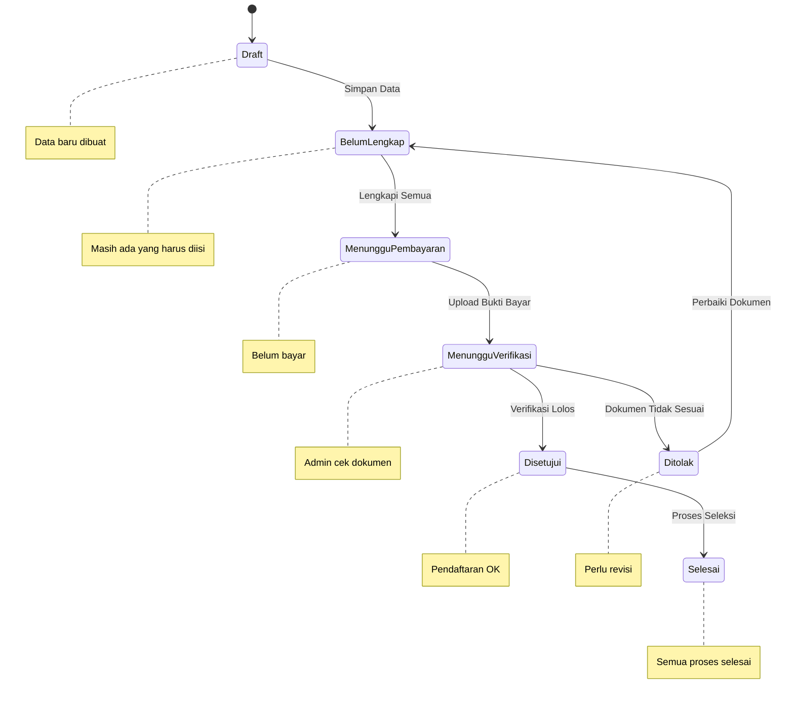

# Status Pendaftaran

Setelah mendaftar dan melakukan pembayaran, Anda dapat memantau status pendaftaran secara real-time melalui dashboard.

## Cara Melihat Status

1. Login ke akun Anda
2. Pada dashboard, lihat bagian **"Status Pendaftaran"**
3. Status akan ditampilkan dengan badge warna

## Arti Setiap Status

### <StatusBadge status="draft" />

Status **Draft** berarti pendaftaran Anda baru dibuat dan belum lengkap.

**Yang harus dilakukan:**
- Lengkapi seluruh data biodata
- Upload dokumen yang diperlukan
- Segera lanjutkan ke proses pembayaran

### <StatusBadge status="belum-lengkap" />

Status **Belum Lengkap** berarti ada data atau dokumen yang masih kurang.

**Yang harus dilakukan:**
- Cek bagian mana yang masih kosong
- Lengkapi data yang diminta
- Upload dokumen yang belum diupload

### <StatusBadge status="menunggu-pembayaran" />

Status **Menunggu Pembayaran** berarti data sudah lengkap tetapi pembayaran belum dilakukan.

**Yang harus dilakukan:**
- Segera lakukan transfer ke rekening yang ditentukan
- Upload bukti pembayaran
- Tunggu verifikasi admin

### <StatusBadge status="menunggu-verifikasi" />

Status **Menunggu Verifikasi** berarti semua data dan dokumen sedang diperiksa oleh admin.

**Yang harus dilakukan:**
- Tunggu proses verifikasi (1x24 jam)
- Periksa notifikasi secara berkala
- Siapkan dokumen fisik jika diperlukan

### <StatusBadge status="disetujui" />

Status **Disetujui** berarti pendaftaran Anda telah diverifikasi dan diterima.

**Yang harus dilakukan:**
- Catat nomor registrasi Anda
- Tunggu pengumuman seleksi berikutnya
- Siapkan dokumen fisik untuk verifikasi lanjutan

### <StatusBadge status="ditolak" />

Status **Ditolak** berarti ada dokumen atau data yang tidak sesuai ketentuan.

**Yang harus dilakukan:**
- Baca catatan dari admin
- Perbaiki dokumen yang ditolak
- Upload ulang dokumen yang diperbaiki
- Hubungi admin jika ada yang tidak jelas

### <StatusBadge status="selesai" />

Status **Selesai** berarti seluruh proses pendaftaran telah selesai.

**Yang harus dilakukan:**
- Tunggu pengumuman hasil seleksi
- Cek jadwal seleksi lanjutan (jika ada)
- Persiapkan diri untuk tahap seleksi

## Timeline Status

| Waktu | Status | Aktivitas |
|-------|--------|-----------|
| Hari 1 | Draft - Belum Lengkap | Mengisi data dan upload dokumen |
| Hari 2 | Menunggu Pembayaran | Transfer dan upload bukti |
| Hari 3 | Menunggu Verifikasi | Admin memeriksa dokumen |
| Hari 4 | Disetujui / Ditolak | Hasil verifikasi |
| Hari 5+ | Selesai | Proses seleksi |

## Notifikasi Status

Anda akan mendapatkan notifikasi ketika:

- Status pendaftaran berubah
- Dokumen ditolak dan perlu diupload ulang
- Pembayaran telah diverifikasi
- Pengumuman hasil seleksi

::: tip
- Periksa status secara rutin, minimal 1x sehari
- Baca notifikasi dengan teliti
- Jika status tidak berubah dalam 3 hari, hubungi admin
- Catat nomor registrasi untuk referensi
:::

## Selanjutnya

Jika ada pertanyaan tentang status pendaftaran, cek [FAQ](/ppdgs/faq) atau [Hubungi Kami](/hubungi-admin).
