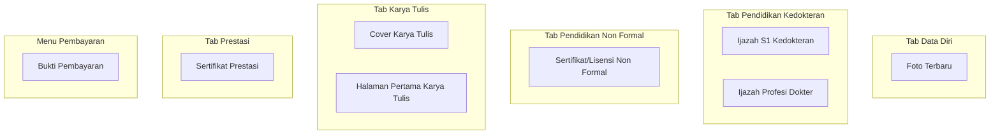

# Daftar Dokumen Wajib

Halaman ini berisi daftar lengkap dokumen yang harus disiapkan untuk pendaftaran PPDS USU.

## Dokumen Wajib

Semua dokumen diupload langsung di dalam tab formulir pendaftaran (kecuali Bukti Pembayaran yang diupload melalui menu Pembayaran terpisah).

### 1. Foto Terbaru

| Detail | Keterangan |
|--------|-----------|
| Upload di Tab | Data Diri |
| Format | JPG |
| Ukuran Maksimal | 1 MB |
| Resolusi Maksimal | 2500 x 1600 px |
| Ketentuan | Foto formal, latar belakang merah, menghadap depan, pakaian rapi |

### 2. Ijazah S1 Kedokteran

| Detail | Keterangan |
|--------|-----------|
| Upload di Tab | Pendidikan Kedokteran |
| Format | JPG |
| Ukuran Maksimal | 1 MB |
| Resolusi Maksimal | 2500 x 1600 px |
| Ketentuan | Scan legalisir basah (bercap dan bertanda tangan), berwarna |

### 3. Ijazah Profesi Dokter

| Detail | Keterangan |
|--------|-----------|
| Upload di Tab | Pendidikan Kedokteran |
| Format | JPG |
| Ukuran Maksimal | 1 MB |
| Resolusi Maksimal | 2500 x 1600 px |
| Ketentuan | Scan legalisir basah (bercap dan bertanda tangan), berwarna |

### 4. Sertifikat / Lisensi Non Formal

| Detail | Keterangan |
|--------|-----------|
| Upload di Tab | Pendidikan Non Formal |
| Format | JPG |
| Ukuran Maksimal | 1 MB |
| Resolusi Maksimal | 2500 x 1600 px |
| Ketentuan | Sertifikat kursus, pelatihan, atau lisensi profesi non formal yang relevan |

### 5. Cover Karya Tulis

| Detail | Keterangan |
|--------|-----------|
| Upload di Tab | Karya Tulis |
| Format | JPG |
| Ukuran Maksimal | 1 MB |
| Resolusi Maksimal | 2500 x 1600 px |
| Ketentuan | Cover atau halaman judul karya tulis ilmiah |

### 6. Halaman Pertama Karya Tulis

| Detail | Keterangan |
|--------|-----------|
| Upload di Tab | Karya Tulis |
| Format | JPG |
| Ukuran Maksimal | 1 MB |
| Resolusi Maksimal | 2500 x 1600 px |
| Ketentuan | Halaman pertama isi karya tulis ilmiah |

### 7. Sertifikat Prestasi

| Detail | Keterangan |
|--------|-----------|
| Upload di Tab | Prestasi dan Penghargaan |
| Format | JPG |
| Ukuran Maksimal | 1 MB |
| Resolusi Maksimal | 2500 x 1600 px |
| Ketentuan | Sertifikat prestasi akademik atau non-akademik |

### 8. Bukti Pembayaran

| Detail | Keterangan |
|--------|-----------|
| Upload di Menu | Pembayaran (terpisah dari form) |
| Format | JPG atau PNG |
| Ketentuan | Screenshot atau scan bukti transfer, nominal dan tanggal terbaca jelas |

## Ringkasan Dokumen

| No | Dokumen | Upload di | Format | Ukuran Maks |
|----|---------|-----------|--------|-------------|
| 1 | Foto Terbaru | Tab Data Diri | JPG | 1 MB |
| 2 | Ijazah S1 Kedokteran | Tab Pendidikan Kedokteran | JPG | 1 MB |
| 3 | Ijazah Profesi Dokter | Tab Pendidikan Kedokteran | JPG | 1 MB |
| 4 | Sertifikat/Lisensi Non Formal | Tab Pendidikan Non Formal | JPG | 1 MB |
| 5 | Cover Karya Tulis | Tab Karya Tulis | JPG | 1 MB |
| 6 | Halaman Pertama Karya Tulis | Tab Karya Tulis | JPG | 1 MB |
| 7 | Sertifikat Prestasi | Tab Prestasi dan Penghargaan | JPG | 1 MB |
| 8 | Bukti Pembayaran | Menu Pembayaran | JPG/PNG | - |

## Ketentuan Umum Upload

 Ketentuan File

Seluruh dokumen berformat **JPG** wajib memenuhi ketentuan berikut:
- **Format**: JPG (JPEG)
- **Ukuran Maksimal**: 1 MB per file
- **Resolusi Maksimal**: 2500 x 1600 piksel
- **Warna**: Berwarna (RGB)
- **Kualitas**: Jelas, tidak buram, tidak terpotong

## Tips Menyiapkan Dokumen

 Tips Menyiapkan Dokumen

1. **Scan dengan resolusi cukup** - 300 DPI sudah memadai, tidak perlu lebih tinggi
2. **Beri nama file yang rapi** - Contoh: `Foto_NamaLengkap.jpg`
3. **Kompres jika terlalu besar** - Gunakan aplikasi image compressor agar ukuran di bawah 1 MB
4. **Simpan di cloud** - Google Drive atau Dropbox sebagai cadangan
5. **Periksa kembali** - Pastikan file tidak corrupt sebelum upload

## Dokumen yang Tidak Perlu Diupload

| Dokumen | Alasan |
|---------|--------|
| KTP | Tidak diperlukan |
| KK | Tidak diperlukan |
| Transkrip Nilai | Tidak diperlukan |
| STR | Tidak diperlukan |
| SIP | Tidak diperlukan |
| CV / Daftar Riwayat Hidup | Tidak diperlukan |
| Surat Rekomendasi | Tidak diperlukan |
| Surat Keterangan Sehat | Tidak diperlukan |
| Sertifikat Kompetensi | Tidak diperlukan |
| Akta Lahir | Tidak diperlukan |
| NPWP | Tidak diperlukan |
