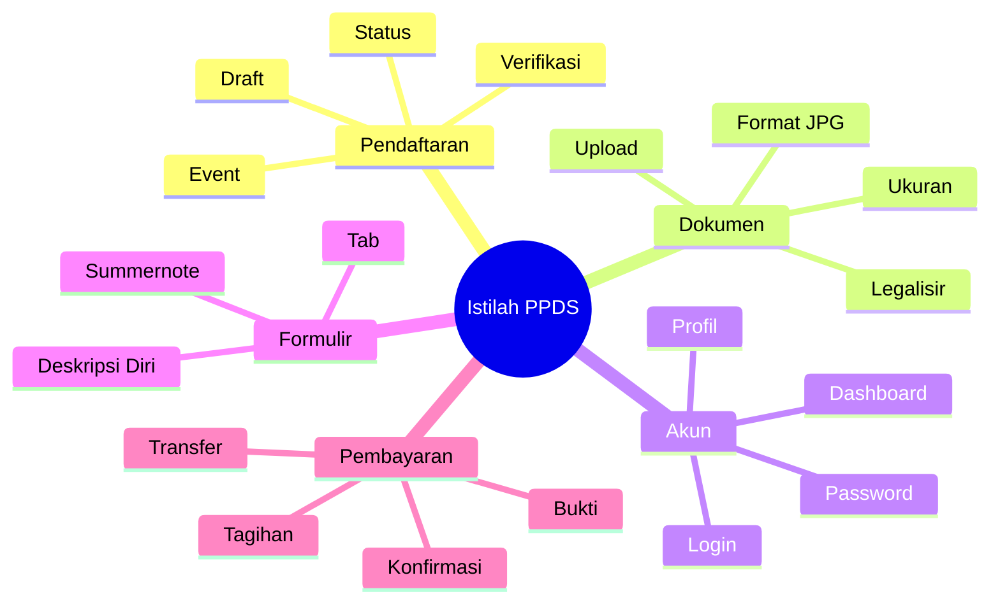

# Istilah-Istilah Pada Sistem

Memahami istilah-istilah yang digunakan dalam aplikasi PPDS akan membantu Anda menggunakan sistem dengan lebih mudah.

## Istilah Umum

### Aplikasi
Perangkat lunak berbasis web yang digunakan untuk mendaftar event PPDS.

### Dashboard
Halaman utama setelah login yang menampilkan informasi penting dan menu-menu aplikasi.

### Event
Kegiatan atau program yang dapat didaftar, dalam hal ini Program Pendidikan Dokter Spesialis (PPDS).

### Program Studi
Bidang spesialisasi dalam PPDS, seperti:
- Bedah Mulut dan Maksilofasial
- Ortodonti
- Periodonti
- Prostodonsia
- Konservasi Gigi
- Pedodonsia
- Radiologi Kedokteran Gigi
- Ilmu Kesehatan Gigi Masyarakat

## Istilah Status Pendaftaran

| Istilah | Arti |
|---------|------|
| **Draft** | Pendaftaran baru dibuat, data belum lengkap |
| **Belum Lengkap** | Masih ada data atau dokumen yang harus diisi |
| **Menunggu Pembayaran** | Data lengkap, tapi pembayaran belum dilakukan |
| **Menunggu Verifikasi** | Semua data sudah dikirim, sedang diperiksa admin |
| **Disetujui** | Pendaftaran diterima dan lolos verifikasi |
| **Ditolak** | Ada dokumen atau data yang tidak sesuai |
| **Selesai** | Seluruh proses pendaftaran telah rampung |

## Istilah Formulir dan Dokumen

| Istilah | Arti |
|---------|------|
| **Tab** | Bagian formulir yang dikelompokkan berdasarkan kategori (Data Diri, Pendidikan Kedokteran, dll.) |
| **Summernote** | Rich text editor yang digunakan untuk menulis jawaban Deskripsi Diri |
| **Deskripsi Diri** | 16 pertanyaan esai yang harus dijawab sebagai bagian dari formulir pendaftaran |
| **Upload** | Proses mengirim file dari perangkat ke server aplikasi |
| **Scan** | Hasil pemindaian dokumen fisik ke format digital JPG |
| **Legalisir** | Pengesahan dokumen oleh institusi berwenang (cap basah + tanda tangan) |
| **Format File** | Jenis file, seluruh dokumen wajib menggunakan **JPG** |
| **Ukuran File** | Besar file dalam satuan KB atau MB, maksimal 1 MB per file |
| **Resolusi** | Ukuran piksel gambar, maksimal 2500 x 1600 px |

## Istilah Akun

| Istilah | Arti |
|---------|------|
| **Registrasi** | Proses pembuatan akun baru |
| **Login** | Proses masuk ke akun yang sudah ada |
| **Logout** | Proses keluar dari akun |
| **Password** | Kata sandi untuk mengamankan akun |
| **Verifikasi Email** | Proses konfirmasi kepemilikan email |
| **Reset Password** | Proses mengganti password yang lupa |

## Istilah Pembayaran

| Istilah | Arti |
|---------|------|
| **Tagihan** | Jumlah biaya yang harus dibayar |
| **Transfer** | Pemindahan dana dari rekening ke rekening tujuan |
| **Bukti Transfer** | Dokumen yang menunjukkan telah melakukan transfer |
| **Verifikasi Pembayaran** | Pemeriksaan bukti transfer oleh admin |
| **Lunas** | Pembayaran telah selesai dan diterima |

## Istilah Teknis

| Istilah | Arti |
|---------|------|
| **Browser** | Program untuk mengakses internet (Chrome, Firefox, Edge) |
| **Cache** | Data sisa browsing yang bisa menyebabkan error |
| **Koneksi** | Hubungan perangkat ke internet |
| **Server** | Komputer pusat yang menjalankan aplikasi |
| **Database** | Tempat penyimpanan data pengguna |

## Singkatan yang Sering Digunakan

| Singkatan | Kepanjangan |
|-----------|-------------|
| **PPDS** | Program Pendidikan Dokter Spesialis |
| **USU** | Universitas Sumatera Utara |
| **FKG** | Fakultas Kedokteran Gigi |
| **IPK** | Indeks Prestasi Kumulatif |
| **JPG/JPEG** | Joint Photographic Experts Group |
| **PNG** | Portable Network Graphics |
| **MB** | Megabyte |
| **KB** | Kilobyte |
| **DPI** | Dots Per Inch (resolusi gambar) |
| **WA** | WhatsApp |
| **HP** | Handphone / Telepon genggam |
