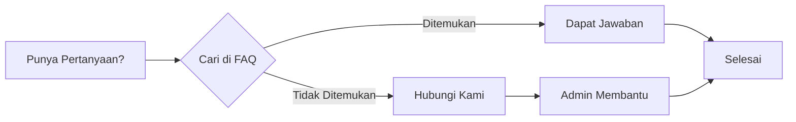

# FAQ - Pertanyaan yang Sering Diajukan

Temukan jawaban atas pertanyaan umum seputar pendaftaran PPDS USU.

## Akun & Login

<FaqAccordion :items="[
  {
    q: 'Bagaimana cara mendaftar akun di aplikasi PPDS?',
    a: 'Buka halaman ppds.usu.ac.id, klik tombol Daftar, isi form dengan data diri Anda, lalu verifikasi email. Anda juga bisa mendaftar menggunakan akun Google untuk proses yang lebih cepat.'
  },
  {
    q: 'Apakah saya bisa mendaftar tanpa email?',
    a: 'Tidak. Email diperlukan untuk verifikasi akun dan komunikasi selama proses pendaftaran. Gunakan email aktif seperti Gmail, Yahoo, atau lainnya.'
  },
  {
    q: 'Mengapa saya tidak menerima email verifikasi?',
    a: 'Cek folder Spam atau Promosi di email Anda. Jika tidak ada, klik Kirim Ulang Verifikasi di halaman login. Pastikan email yang dimasukkan benar.'
  },
  {
    q: 'Apakah saya bisa menggunakan nomor HP luar negeri?',
    a: 'Ya, bisa. Masukkan nomor dengan kode negara yang sesuai, misalnya +62 untuk Indonesia.'
  },
  {
    q: 'Berapa lama proses verifikasi email?',
    a: 'Email verifikasi biasanya terkirim dalam 1-5 menit. Jika lebih dari 15 menit, coba kirim ulang atau gunakan email lain.'
  },
  {
    q: 'Bagaimana cara login menggunakan Google?',
    a: 'Klik tombol Login dengan Google di halaman login, pilih akun Google yang sudah didaftarkan saat registrasi.'
  },
  {
    q: 'Saya lupa password, bagaimana cara reset?',
    a: 'Klik Lupa Password di halaman login, masukkan email terdaftar, lalu ikuti link reset yang dikirim ke email Anda.'
  },
  {
    q: 'Apakah akun bisa digunakan untuk beberapa event?',
    a: 'Ya, satu akun bisa digunakan untuk mendaftar di beberapa event PPDS selama event tersebut masih dibuka.'
  },
  {
    q: 'Bisakah saya mengganti email yang sudah terdaftar?',
    a: 'Email tidak bisa diganti sendiri. Hubungi admin untuk mengubah email yang terdaftar di akun Anda.'
  },
  {
    q: 'Mengapa akun saya terkunci?',
    a: 'Akun terkunci setelah 5 kali gagal login. Tunggu 30 menit untuk mencoba lagi atau hubungi admin.'
  },
]" />

## Pendaftaran Event

<FaqAccordion :items="[
  {
    q: 'Bagaimana cara melihat daftar event yang tersedia?',
    a: 'Login ke dashboard, lalu klik menu Event atau Daftar Event untuk melihat semua event PPDS yang sedang dibuka.'
  },
  {
    q: 'Apakah saya bisa mendaftar lebih dari satu program studi?',
    a: 'Tergantung ketentuan event. Beberapa event mengizinkan pilihan lebih dari satu program studi. Cek detail event untuk informasi lebih lanjut.'
  },
  {
    q: 'Berapa biaya pendaftaran PPDS?',
    a: 'Biaya pendaftaran bervariasi tergantung program studi. Informasi biaya dapat dilihat di halaman detail event.'
  },
  {
    q: 'Apakah ada batas usia untuk mendaftar PPDS?',
    a: 'Ketentuan batas usia dapat berbeda setiap tahun. Cek syarat dan ketentuan di halaman detail event atau hubungi panitia.'
  },
  {
    q: 'Kapan batas akhir pendaftaran?',
    a: 'Batas pendaftaran tertera di halaman detail event. Pastikan mendaftar sebelum batas waktu yang ditentukan.'
  },
  {
    q: 'Apakah saya bisa membatalkan pendaftaran?',
    a: 'Pembatalan pendaftaran dapat dilakukan sebelum verifikasi admin. Hubungi admin untuk proses pembatalan. Biaya pendaftaran tidak dapat dikembalikan.'
  },
  {
    q: 'Bagaimana jika saya mendaftar di event yang salah?',
    a: 'Hubungi admin segera untuk membatalkan pendaftaran dan mendaftar ulang di event yang benar.'
  },
  {
    q: 'Apa yang dimaksud dengan status Draft?',
    a: 'Status Draft berarti data pendaftaran Anda baru dibuat dan belum lengkap. Anda perlu melengkapi semua data dan dokumen yang diperlukan.'
  },
]" />

## Biodata & Dokumen

<FaqAccordion :items="[
  {
    q: 'Dokumen apa saja yang harus disiapkan?',
    a: 'Dokumen yang diperlukan: KTP, Ijazah S1, Transkrip Nilai, STR, Pas Foto, CV, Surat Rekomendasi, dan Surat Keterangan Sehat. Cek halaman Persiapan untuk detail lengkapnya.'
  },
  {
    q: 'Berapa ukuran maksimal file yang bisa diupload?',
    a: 'Ukuran maksimal bervariasi: Pas foto 500KB, dokumen umum 2MB, ijazah dan transkrip 5MB. Cek ketentuan di halaman Upload Dokumen.'
  },
  {
    q: 'Format file apa yang didukung?',
    a: 'Pas foto: JPG/PNG. Dokumen lainnya: PDF. Pastikan file tidak corrupt sebelum diupload.'
  },
  {
    q: 'Bagaimana cara mengganti file yang sudah diupload?',
    a: 'Buka menu Upload Dokumen, cari dokumen yang ingin diganti, klik Ganti File, pilih file baru, lalu upload. File lama akan terganti otomatis.'
  },
  {
    q: 'Mengapa upload dokumen gagal terus?',
    a: 'Penyebab umum: file terlalu besar, format tidak sesuai, koneksi internet tidak stabil. Coba kompres file, periksa format, atau gunakan koneksi yang lebih stabil.'
  },
  {
    q: 'Apakah dokumen harus dilegalisir?',
    a: 'Ya, ijazah dan transkrip nilai harus berupa scan legalisir basah (bercap dan bertanda tangan asli).'
  },
  {
    q: 'Apakah pas foto harus dengan latar merah?',
    a: 'Ya, pas foto harus dengan latar belakang merah, ukuran 4x6, dan tidak menggunakan kacamata.'
  },
  {
    q: 'Bagaimana jika saya tidak memiliki STR?',
    a: 'STR adalah syarat wajib. Jika belum memiliki STR, urus terlebih dahulu ke Konsil Kedokteran Indonesia (KKI).'
  },
  {
    q: 'Apakah surat rekomendasi bisa dari dosen?',
    a: 'Ya, surat rekomendasi bisa dari atasan di tempat kerja, dosen pembimbing, atau tokoh akademik yang relevan.'
  },
  {
    q: 'Berapa lama proses verifikasi dokumen?',
    a: 'Proses verifikasi dokumen biasanya 1x24 jam pada hari kerja. Jika lebih dari 3 hari, hubungi admin.'
  },
]" />

## Pembayaran

<FaqAccordion :items="[
  {
    q: 'Bagaimana cara melakukan pembayaran?',
    a: 'Transfer ke rekening yang tertera di halaman Pembayaran, lalu upload bukti transfer melalui menu Upload Bukti Manual.'
  },
  {
    q: 'Berapa lama batas waktu pembayaran?',
    a: 'Batas waktu pembayaran adalah 7 hari setelah pendaftaran. Jika melewati batas, pendaftaran akan dianggap mengundurkan diri.'
  },
  {
    q: 'Apakah biaya pendaftaran bisa dicicil?',
    a: 'Tidak. Pembayaran harus dilakukan secara penuh dalam satu kali transfer sesuai tagihan.'
  },
  {
    q: 'Bagaimana jika saya transfer dengan nominal berbeda?',
    a: 'Transfer dengan nominal berbeda akan menyulitkan verifikasi. Hubungi admin jika terlanjur transfer dengan nominal yang salah.'
  },
  {
    q: 'Berapa lama verifikasi pembayaran?',
    a: 'Verifikasi pembayaran dilakukan dalam 1x24 jam pada hari kerja setelah bukti transfer diupload.'
  },
  {
    q: 'Apakah biaya pendaftaran bisa refund?',
    a: 'Biaya pendaftaran tidak dapat dikembalikan dalam kondisi apapun, termasuk pembatalan pendaftaran.'
  },
  {
    q: 'Bank apa saja yang bisa digunakan?',
    a: 'Pembayaran dapat dilakukan melalui Bank Mandiri, BNI, atau BRI sesuai rekening yang tertera di halaman Pembayaran.'
  },
  {
    q: 'Bagaimana jika bukti transfer hilang?',
    a: 'Hubungi bank Anda untuk mencetak ulang bukti transfer atau screenshot ulang dari aplikasi mobile banking.'
  },
]" />

## Teknis

<FaqAccordion :items="[
  {
    q: 'Aplikasi ini bisa diakses dari HP?',
    a: 'Ya, aplikasi dapat diakses dari smartphone, tablet, laptop, dan PC. Pastikan browser Anda dalam versi terbaru.'
  },
  {
    q: 'Browser apa yang disarankan?',
    a: 'Gunakan Google Chrome, Mozilla Firefox, atau Microsoft Edge versi terbaru untuk pengalaman terbaik.'
  },
  {
    q: 'Mengapa halaman tidak bisa dimuat?',
    a: 'Coba refresh halaman, clear cache browser, atau gunakan mode incognito/private. Periksa juga koneksi internet Anda.'
  },
  {
    q: 'Apakah data saya aman?',
    a: 'Ya, data Anda dilindungi dengan enkripsi. Aplikasi menggunakan protokol keamanan HTTPS untuk melindungi data pribadi.'
  },
  {
    q: 'Bagaimana cara logout dari aplikasi?',
    a: 'Klik ikon profil di pojok kanan atas, lalu pilih menu Logout atau Keluar.'
  },
  {
    q: 'Apakah ada aplikasi mobile khusus?',
    a: 'Saat ini aplikasi dapat diakses melalui browser. Belum tersedia aplikasi mobile khusus untuk PPDS.'
  },
  {
    q: 'Apa yang harus dilakukan jika ada error pada sistem?',
    a: 'Ambil screenshot error, catat pesan yang muncul, lalu laporkan ke admin melalui WhatsApp atau email.'
  },
]" />

## Lainnya

<FaqAccordion :items="[
  {
    q: 'Bagaimana cara menghubungi admin?',
    a: 'Hubungi admin melalui WhatsApp 0811-6789-0123 atau email ppds@usu.ac.id pada jam kerja (Senin-Jumat, 08.00-16.00 WIB).'
  },
  {
    q: 'Apadaun pendaftaran offline?',
    a: 'Pendaftaran dilakukan secara online melalui aplikasi. Jika ada kesulitan, hubungi admin untuk bantuan.'
  },
  {
    q: 'Kapan pengumuman hasil seleksi?',
    a: 'Jadwal pengumuman akan diinformasikan melalui dashboard dan notifikasi. Pantau terus status pendaftaran Anda.'
  },
  {
    q: 'Apakah saya bisa mengecek status di HP?',
    a: 'Ya, dashboard dapat diakses dari HP melalui browser. Status pendaftaran dapat dipantau kapan saja.'
  },
  {
    q: 'Siapa yang bisa saya hubungi untuk masalah teknis?',
    a: 'Hubungi admin teknis melalui WhatsApp atau email yang tertera di halaman Hubungi Kami.'
  },
]" />

---

Tidak menemukan jawaban? [Hubungi Kami](/hubungi-admin) untuk bantuan lebih lanjut.
