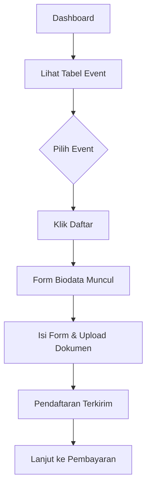

# Mendaftar Event

Setelah login, Anda dapat mendaftar ke event PPDS yang tersedia langsung dari dashboard.

## Melihat Daftar Event

1. Login ke akun Anda
2. Pada dashboard, Anda akan melihat tabel daftar event PPDS yang tersedia

   | Informasi | Keterangan |
   |-----------|-----------|
   | Nama Event | PPDS Periode 2025/2026 |
   | Program Studi | Bedah Mulut, Ortodonti, dll |
   | Kuota | Tersedia / Terisi |
   | Batas Pendaftaran | 31 Maret 2025 |
   | Status | Dibuka / Ditutup |

## Mendaftar ke Event

1. Pada tabel event, klik tombol **"Daftar"** pada event yang Anda minati
2. Form Biodata akan muncul dengan beberapa tab yang perlu diisi:

   - **Tab 1: Data Diri** -- Isi data pribadi, termasuk **Program Dokter Spesialis yang dipilih**
   - **Tab 2: Pendidikan Kedokteran** -- Upload ijazah S1 dan Profesi
   - **Tab 3: Pendidikan Non Formal** -- Upload sertifikat (jika ada)
   - **Tab 4: Karya Tulis** -- Upload cover dan halaman pertama karya tulis
   - **Tab 5: Prestasi** -- Upload sertifikat prestasi (jika ada)

3. Setelah semua data terisi, klik **"Simpan"**
4. Pendaftaran berhasil dikirim

Perhatian

Program Dokter Spesialis yang dipilih diisi pada Tab 1 Data Diri, bukan sebelum form.

## Setelah Mendaftar

Setelah pendaftaran terkirim, status pendaftaran Anda akan muncul di dashboard dengan status awal **Draft**.

Langkah selanjutnya:

1. Segera lakukan [Pembayaran](/ppds/pembayaran)
2. Pantau [Status Pendaftaran](/ppds/status-pendaftaran)
3. Lengkapi data jika ada yang kurang

## Hal yang Perlu Diperhatikan

Perhatian

- Pastikan semua dokumen sudah diupload melalui form biodata sebelum menyelesaikan pendaftaran
- Beberapa event memiliki batas waktu pendaftaran yang ketat
- Jika mendaftar di beberapa event, perhatikan jadwal masing-masing

Tips

Pilih program studi yang sesuai dengan latar belakang pendidikan dan pengalaman Anda. Baca deskripsi program studi dengan teliti.

