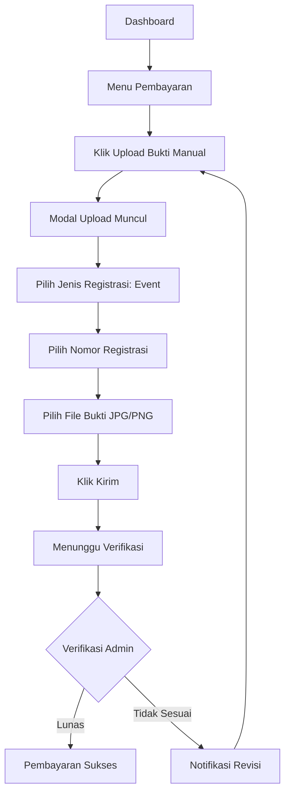

# Pembayaran

Setelah mendaftar event, Anda perlu melakukan pembayaran biaya pendaftaran. Ikuti langkah-langkah berikut untuk melakukan pembayaran.

## Masuk Menu Pembayaran

1. Login ke akun Anda
2. Pada dashboard, klik menu **"Pembayaran"**
3. Anda akan melihat halaman pembayaran

## Upload Bukti Manual

1. Pada halaman Pembayaran, klik **"Upload Bukti Manual"**
2. Akan muncul modal dengan field berikut:

   | Field | Keterangan |
   |-------|-----------|
   | Jenis Registrasi | Pilih "Event" |
   | Nomor Registrasi | Pilih nomor registrasi dari dropdown |
   | Upload Bukti | File bukti transfer (JPG/PNG, max 1MB) |

3. Klik **"Kirim"**

Tips Upload

- Gunakan format file JPG atau PNG untuk bukti transfer
- Pastikan bukti terbaca jelas (nominal, tanggal, nama terlihat)

### Menunggu Verifikasi

Setelah mengupload bukti, status pembayaran akan berubah menjadi **"Menunggu Verifikasi"**.

Admin akan memverifikasi pembayaran Anda dalam **1x24 jam** (hari kerja).

## Status Pembayaran

| Status | Arti |
|--------|------|
| Belum Bayar | Anda belum melakukan pembayaran |
| Menunggu Verifikasi | Bukti sudah diupload, menunggu cek admin |
| Lunas | Pembayaran diterima dan dicocokkan |
| Ditolak | Bukti tidak sesuai, upload ulang |

## Yang Perlu Diperhatikan

Peringatan

- Lakukan pembayaran sebelum batas waktu yang ditentukan
- Pembayaran yang melebihi batas waktu akan dianggap **MENGUNDURKAN DIRI**
- Biaya pendaftaran **tidak dapat dikembalikan** jika pendaftaran dibatalkan
- Hubungi admin jika ada kendala dalam pembayaran

Perhatian

Jika status pembayaran masih "Menunggu Verifikasi" lebih dari 2 hari, hubungi admin untuk mengecek status.

## Selanjutnya

Setelah pembayaran diverifikasi, Anda bisa memantau [Status Pendaftaran](/ppds/status-pendaftaran).
