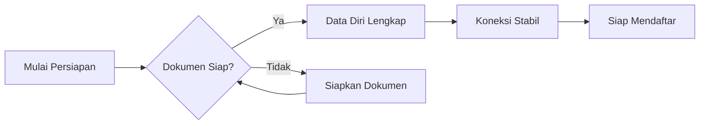

# Persiapan Pendaftaran

Sebelum memulai proses pendaftaran, pastikan Anda telah menyiapkan semua dokumen dan data yang diperlukan. Persiapan yang baik akan memperlancar proses pendaftaran.

## Data Diri yang Harus Disiapkan

| Data | Keterangan |
|------|-----------|
| Nama Lengkap | Sesuai ijazah |
| Tempat & Tanggal Lahir | Sesuai akta kelahiran |
| Jenis Kelamin | Laki-laki / Perempuan |
| Agama | Sesuai KTP |
| Alamat | Alamat lengkap |
| Nomor HP | Nomor aktif Whatsapp |
| Email | Email aktif |
| Program Spesialis yang Dipilih | Pilih program studi tujuan |
| Alasan | Alasan memilih program spesialis |

## Dokumen yang Wajib Disiapkan

| Dokumen | Format | Ukuran | Keterangan |
|---------|--------|--------|-----------|
| Foto Terbaru | JPG | 1 MB | 2500x1600px, latar merah |
| Ijazah S1 Kedokteran Gigi | JPG | 1 MB | Scan jelas, per file |
| Ijazah Profesi Dokter Gigi | JPG | 1 MB | Scan jelas, per file |
| Sertifikat Non Formal | JPG | 1 MB | Jika ada, scan jelas |
| Cover Karya Tulis | JPG | 1 MB | Cover karya tulis ilmiah |
| Halaman Pertama Karya Tulis | JPG | 1 MB | Halaman 1 karya tulis |
| Sertifikat Prestasi | JPG | 1 MB | Jika ada, scan jelas |

Tips Mempersiapkan Dokumen

- Gunakan format JPG dengan resolusi maksimal 2500x1600px
- Simpan dokumen dengan nama file yang rapi (contoh: `Foto_Andi.jpg`)
- Pastikan file tidak rusak (corrupt) sebelum diupload
- Siapkan semua file sebelum mulai mengisi form

## Persyaratan Hardware & Software

### Perangkat yang Disarankan

| Perangkat | Spesifikasi Minimal |
|-----------|-------------------|
| Laptop / PC | RAM 4 GB, layar 1366x768 |
| Smartphone | Android 8 / iOS 13 ke atas |
| Browser | Chrome 90+, Firefox 90+, Edge 90+ |

### Koneksi Internet

Perhatian

Koneksi internet yang stabil sangat diperlukan, terutama saat:
- Upload dokumen (file gambar)
- Mengisi form biodata
- Melakukan pembayaran online

## Checklist Persiapan

Gunakan daftar berikut untuk memastikan semua sudah siap:

- [ ] Email aktif
- [ ] Nomor HP Whatsapp aktif
- [ ] Foto terbaru ukuran 2500x1600px, format JPG
- [ ] Ijazah S1 Kedokteran Gigi (scan, format JPG)
- [ ] Ijazah Profesi Dokter Gigi (scan, format JPG)
- [ ] Sertifikat Non Formal (jika ada)
- [ ] Cover Karya Tulis (format JPG)
- [ ] Halaman Pertama Karya Tulis (format JPG)
- [ ] Sertifikat Prestasi (jika ada)
- [ ] Koneksi internet stabil
- [ ] Browser terbaru

## Selanjutnya

Setelah semua persiapan selesai, lanjut ke [Registrasi Akun](/ppds/registrasi-akun).
